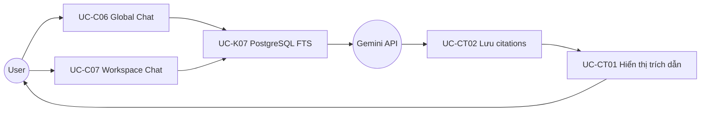
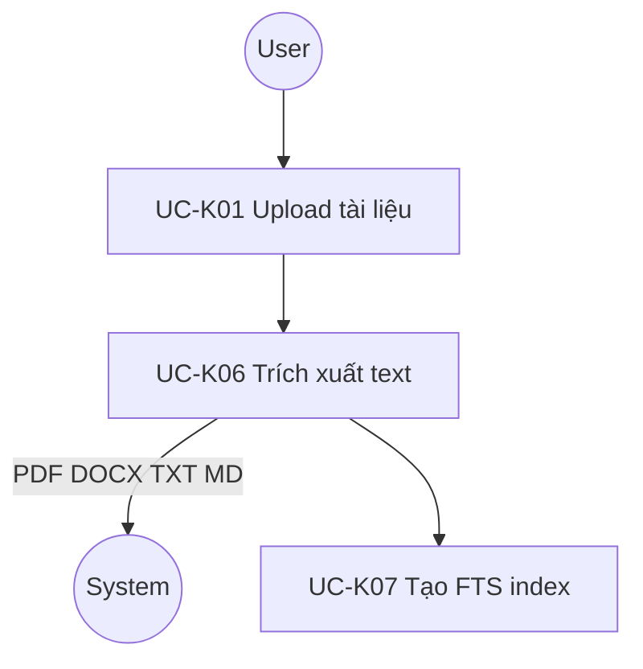
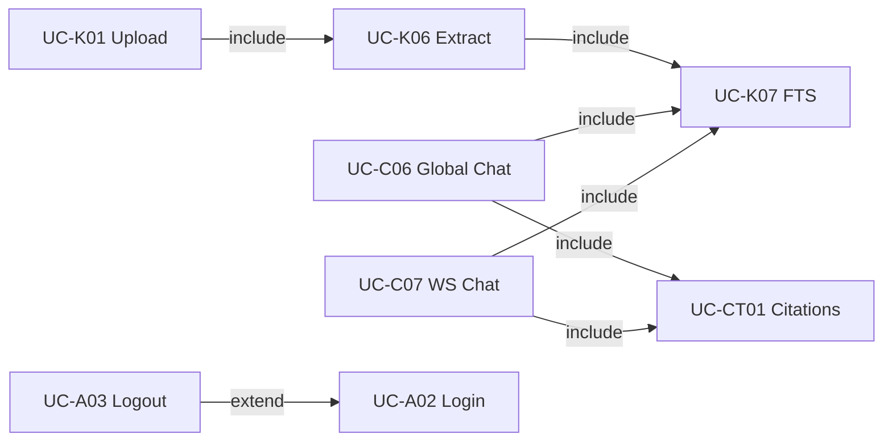

# 2. Use Case Diagram

> **Mã Use Case chuẩn:** [00-Use-Case-Master.md](./00-Use-Case-Master.md)  
> **Phạm vi diagram dưới đây:** MVP-8W (Official Implementation Target)

---

## 2.1 Use Case Diagram — MVP-8W

```mermaid
graph TB
    subgraph Actors
        Guest((Guest))
        User((User))
        System((System))
        Gemini((Gemini API))
    end

    subgraph "Authentication UC-A"
        UCA01[UC-A01 Đăng ký Email]
        UCA02[UC-A02 Đăng nhập Email]
        UCA03[UC-A03 Đăng xuất]
        UCA04[UC-A04 Refresh Token]
    end

    subgraph "Profile UC-P"
        UCP01[UC-P01 Xem hồ sơ]
        UCP02[UC-P02 Cập nhật hồ sơ]
    end

    subgraph "Workspace UC-W"
        UCW01[UC-W01 Danh sách WS]
        UCW02[UC-W02 Tạo WS]
        UCW03[UC-W03 Xem WS]
        UCW04[UC-W04 Cập nhật WS]
        UCW05[UC-W05 Xóa WS]
    end

    subgraph "Folder UC-F"
        UCF01[UC-F01 Danh sách Folder]
        UCF02[UC-F02 Tạo Folder]
        UCF03[UC-F03 Cập nhật Folder]
        UCF04[UC-F04 Xóa Folder]
    end

    subgraph "Document UC-K"
        UCK01[UC-K01 Upload]
        UCK02[UC-K02 Danh sách]
        UCK03[UC-K03 Xem tài liệu]
        UCK04[UC-K04 Xem chunks]
        UCK05[UC-K05 Xóa]
        UCK06[UC-K06 Trích xuất & chunk]
        UCK07[UC-K07 FTS Search]
    end

    subgraph "AI Chat UC-C"
        UCC01[UC-C01 Danh sách chat]
        UCC02[UC-C02 Tạo chat]
        UCC03[UC-C03 Xem lịch sử]
        UCC04[UC-C04 Đổi tên]
        UCC05[UC-C05 Xóa chat]
        UCC06[UC-C06 Global Chat]
        UCC07[UC-C07 Workspace Chat]
    end

    subgraph "Citation UC-CT"
        UCCT01[UC-CT01 Hiển thị trích dẫn]
        UCCT02[UC-CT02 Lưu trích dẫn]
    end

    Guest --> UCA01
    Guest --> UCA02
    User --> UCA02
    User --> UCA03
    User --> UCA04
    User --> UCP01
    User --> UCP02
    User --> UCW01 & UCW02 & UCW03 & UCW04 & UCW05
    User --> UCF01 & UCF02 & UCF03 & UCF04
    User --> UCK01 & UCK02 & UCK03 & UCK05
    User --> UCC01 & UCC02 & UCC03 & UCC04 & UCC05
    User --> UCC06 & UCC07
    User --> UCCT01

    UCK01 --> UCK06
    UCK06 --> UCK07
    UCC06 --> UCK07
    UCC07 --> UCK07
    UCC06 -.-> Gemini
    UCC07 -.-> Gemini
    UCC06 --> UCCT01
    UCC07 --> UCCT01
    UCC06 --> UCCT02
    UCC07 --> UCCT02
    UCCT02 --> System
    UCK06 --> System
```

---

## 2.2 Use Case Diagram — AI Chat & Citation (chi tiết)

**Citation output bắt buộc (MVP):**

| Field | Mô tả | Ví dụ |
|-------|-------|-------|
| source_name | Tên file | `Spring_Boot_Basic.pdf` |
| page_number | Số trang | `15` |
| line_start | Dòng bắt đầu | `120` |
| line_end | Dòng kết thúc | `145` |

---

## 2.3 Use Case Diagram — Document Processing

**Định dạng file MVP:** PDF, DOCX, TXT, Markdown

---

## 2.4 Bảng mô tả Use Case MVP

| UC ID | Tên | Actor | Precondition | Postcondition |
|-------|-----|-------|--------------|---------------|
| UC-A01 | Đăng ký Email | Guest | Email chưa tồn tại | User + profile created, JWT issued |
| UC-A02 | Đăng nhập | Guest/User | Credentials hợp lệ | access_token + refresh_token |
| UC-A03 | Đăng xuất | User | Đã đăng nhập | Popup xác nhận, revoke refresh_token |
| UC-A04 | Refresh Token | User | refresh_token hợp lệ | New access_token |
| UC-K01 | Upload tài liệu | User | Workspace tồn tại | Document status=processing→processed |
| UC-C06 | Global Chat | User | Có documents processed | Answer + citations (file, page, line) |
| UC-C07 | Workspace Chat | User | Chat scoped to workspace | Answer + citations trong workspace |
| UC-CT01 | Hiển thị trích dẫn | User | Assistant message exists | UI shows source_name, page, lines |

---

## 2.5 Quan hệ Include / Extend

---

## 2.6 Post-MVP Use Cases (tham chiếu)

Xem danh sách đầy đủ tại [00-Use-Case-Master.md](./00-Use-Case-Master.md) — bao gồm OAuth, Website, Notes, Bookmark, Statistics, Admin, AI Doc Assistant.
 