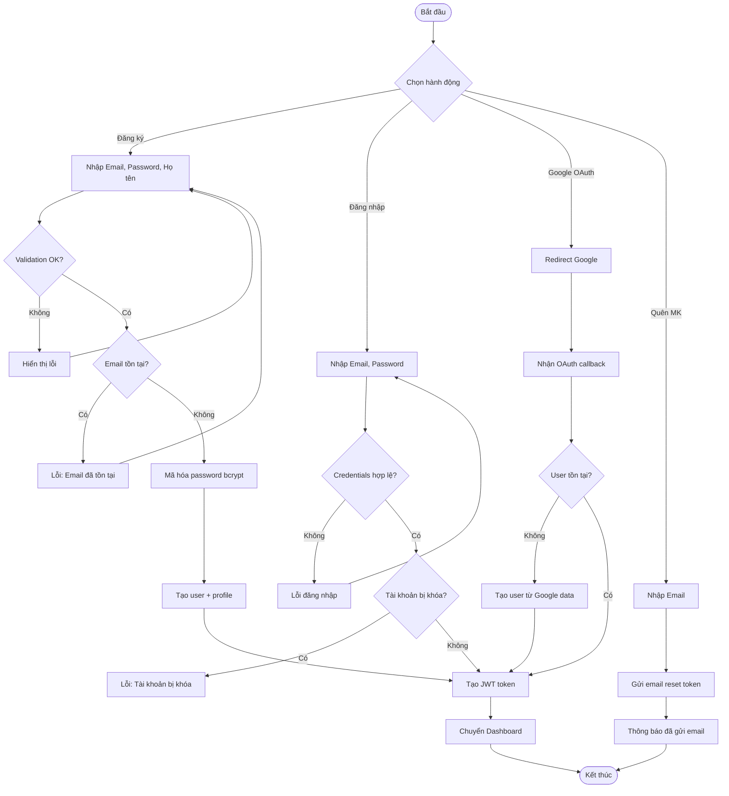
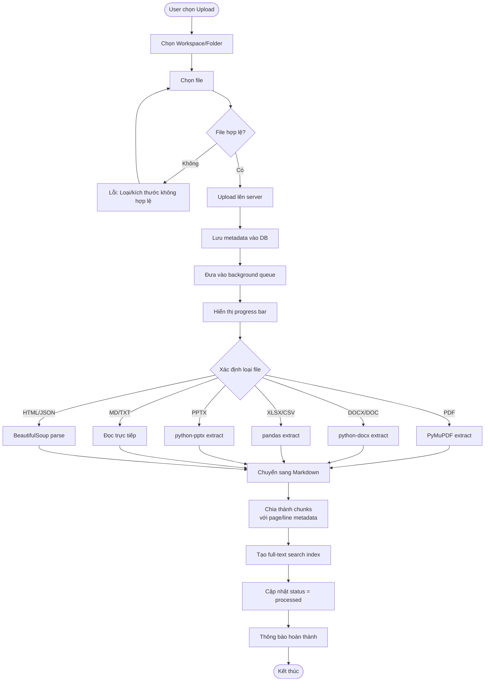
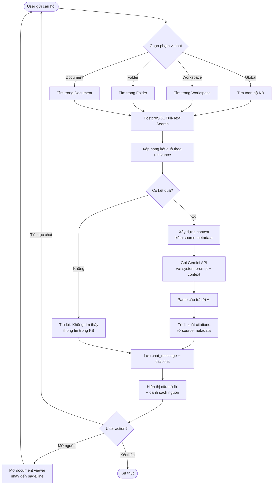
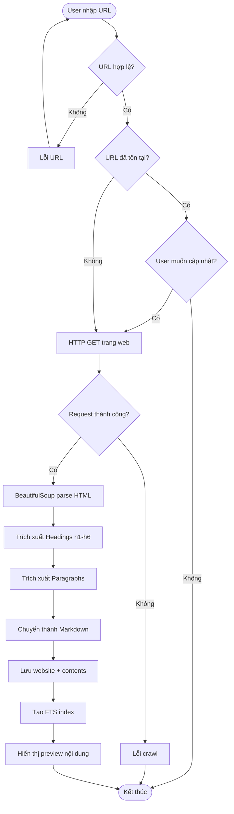
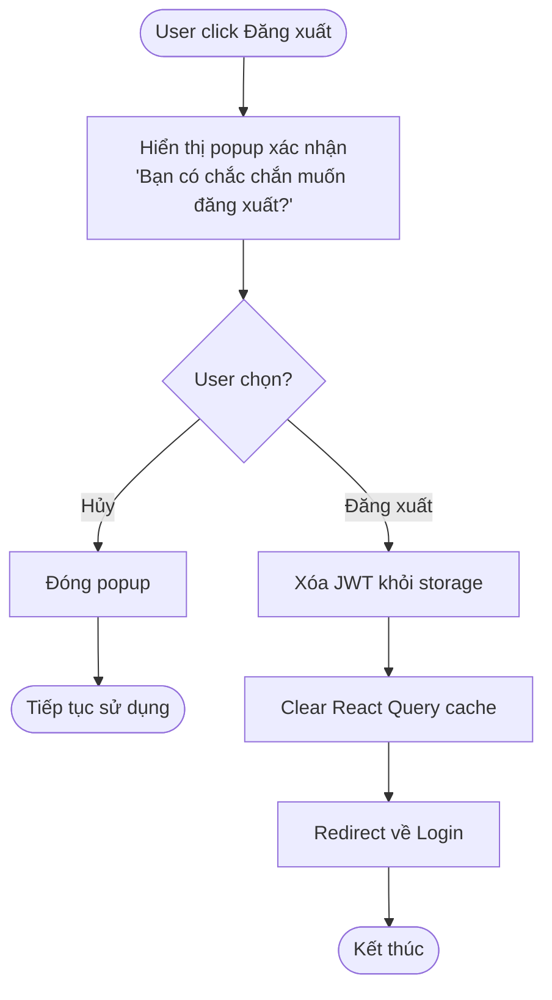
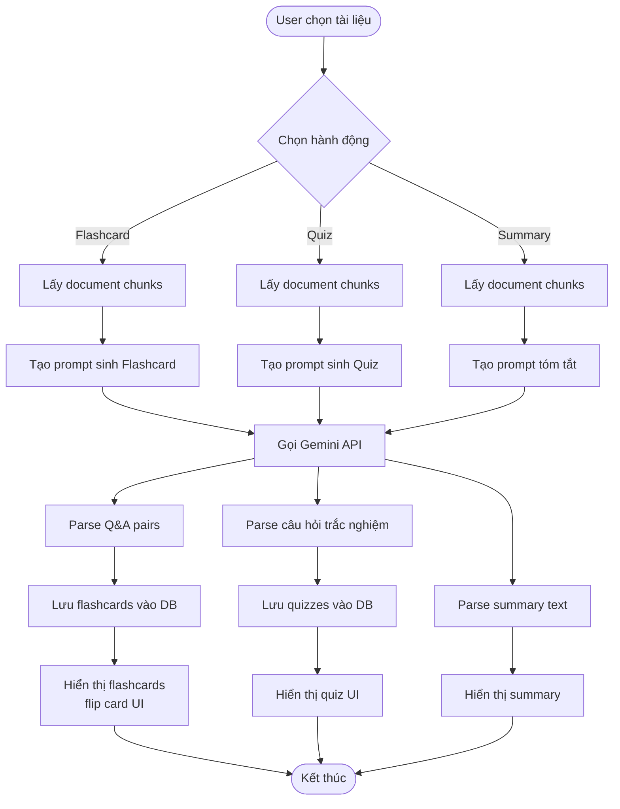

# 3. Activity Diagram

## 3.1 Activity Diagram — Đăng ký & Đăng nhập

## 3.2 Activity Diagram — Upload & Xử lý Tài liệu

## 3.3 Activity Diagram — AI Chat với Citation

## 3.4 Activity Diagram — Crawl Website

## 3.5 Activity Diagram — Đăng xuất

## 3.6 Activity Diagram — Sinh Flashcard/Quiz

