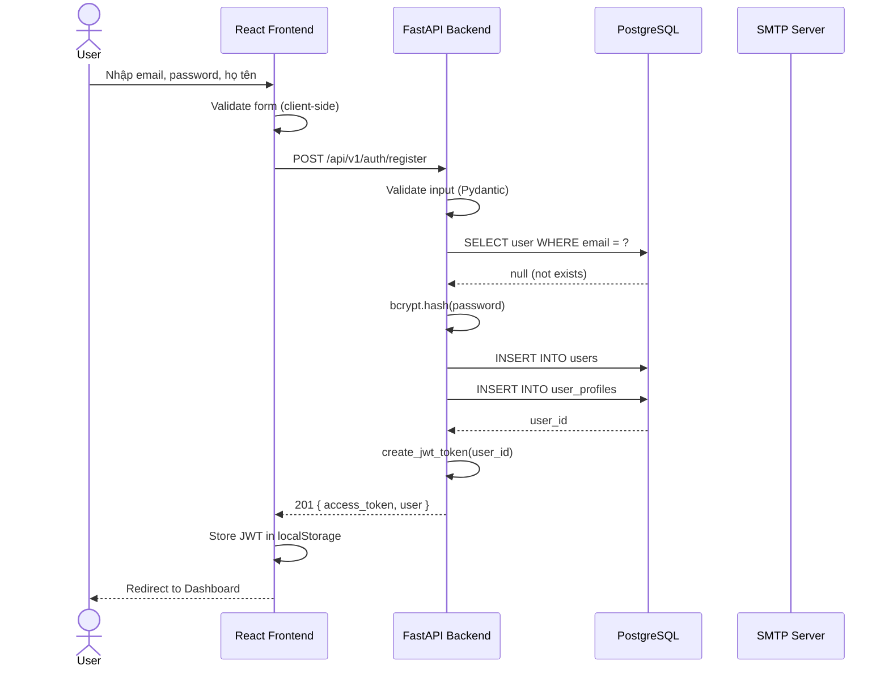
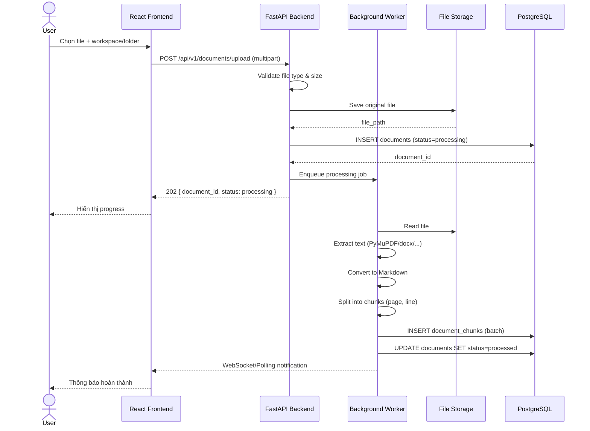
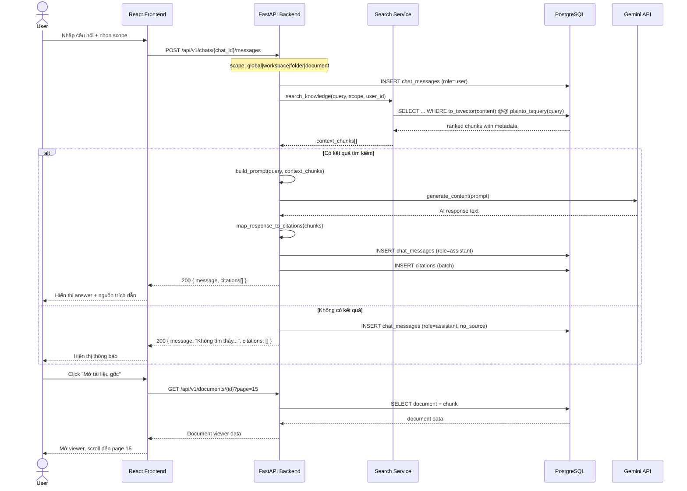
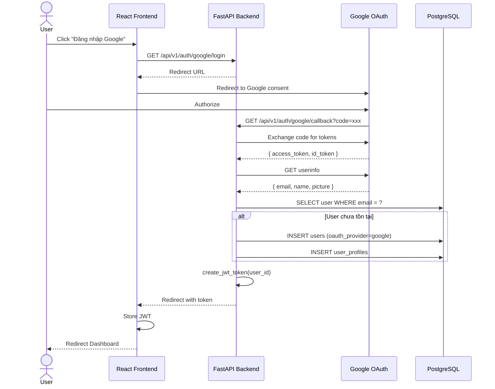
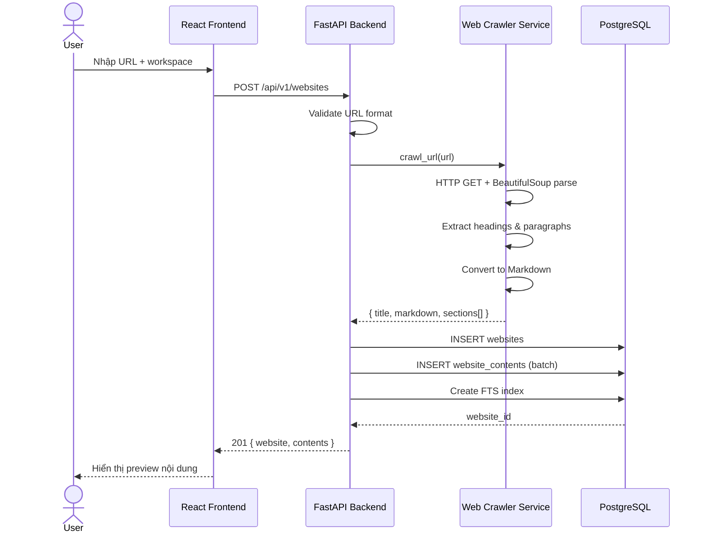
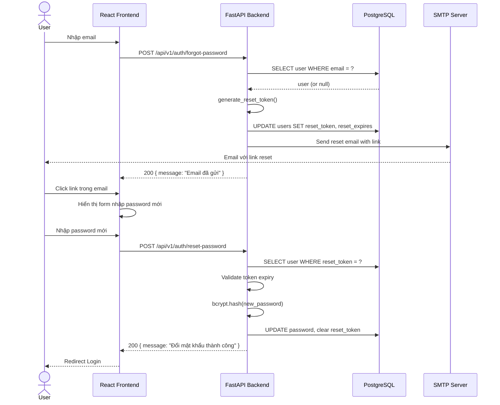
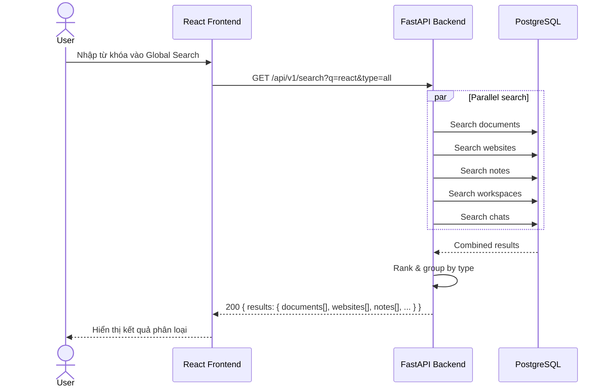

# 4. Sequence Diagram

## 4.1 Sequence Diagram — Đăng ký Email

## 4.2 Sequence Diagram — Upload Document

## 4.3 Sequence Diagram — AI Chat với Citation (Core Flow)

## 4.4 Sequence Diagram — Google OAuth Login

## 4.5 Sequence Diagram — Crawl Website

## 4.6 Sequence Diagram — Quên mật khẩu

## 4.7 Sequence Diagram — Global Search

