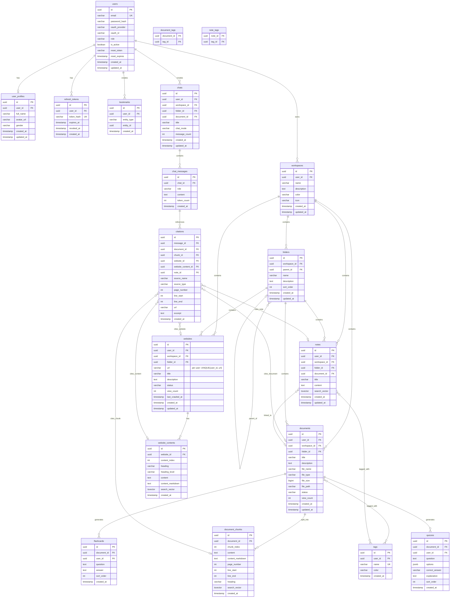
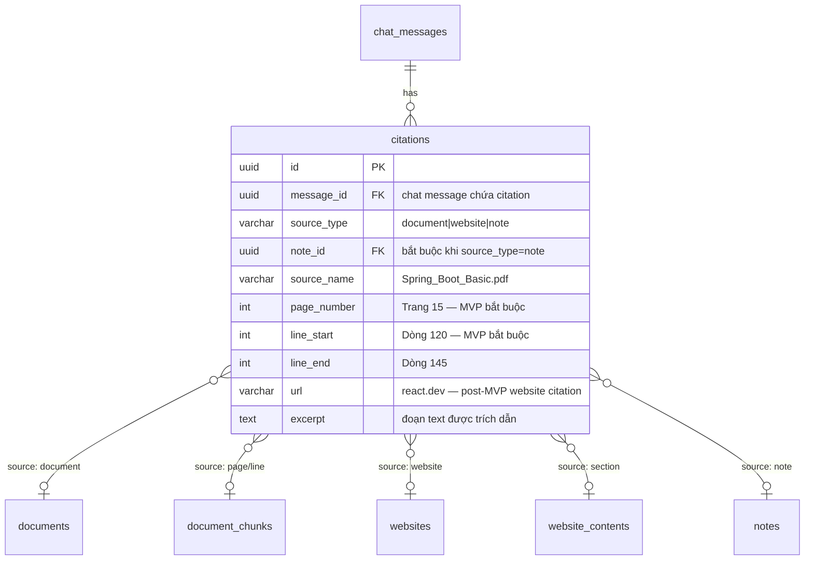
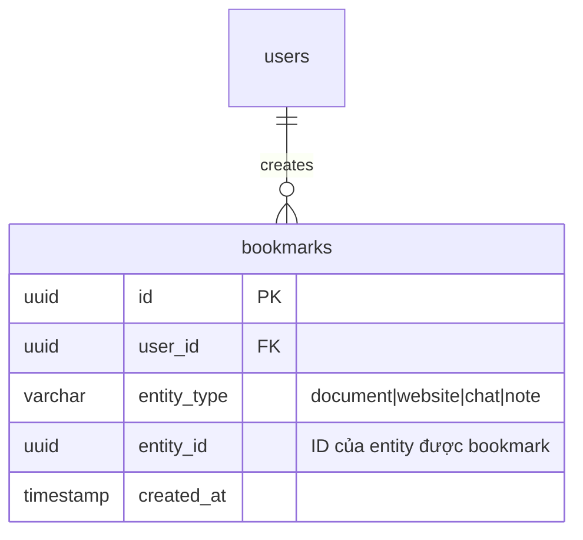

# 5. ERD — Crow's Foot Notation

## 5.1 ERD Diagram tổng quan

## 5.2 Cardinality Legend (Crow's Foot)

| Ký hiệu | Ý nghĩa |
|---------|---------|
| `\|\|` | Exactly one (bắt buộc) |
| `o\|` | Zero or one (tùy chọn) |
| `\|{` | One or many |
| `o{` | Zero or many |

## 5.3 Quan hệ chính

| Quan hệ | Cardinality | Mô tả |
|---------|-------------|-------|
| users → user_profiles | 1:1 | Mỗi user có 1 profile |
| users → workspaces | 1:N | User sở hữu nhiều workspace |
| workspaces → folders | 1:N | Workspace chứa nhiều folder |
| workspaces → documents | 1:N | Workspace chứa nhiều document |
| folders → documents | 1:N | Folder chứa nhiều document |
| documents → document_chunks | 1:N | Document chia thành nhiều chunk |
| documents ↔ tags | N:M | Document gắn nhiều tag (qua document_tags) |
| websites → website_contents | 1:N | Website có nhiều content section |
| chats → chat_messages | 1:N | Chat có nhiều message |
| chat_messages → citations | 1:N | Message có nhiều citation |
| citations → documents | N:1 | Citation trỏ đến document |
| citations → document_chunks | N:1 | Citation trỏ đến chunk cụ thể |

## 5.4 ERD — Citation System (chi tiết)

## 5.5 ERD — Polymorphic Bookmark

> **Lưu ý:** Bookmark sử dụng polymorphic association (`entity_type` + `entity_id`) thay vì FK riêng cho từng loại, giảm số bảng junction.
