# 05 — Entity Relationship Diagram (ERD)

> **Project:** DevHub AI  
> **Notation:** Crow's Foot (Mermaid `erDiagram`)  
> **Database:** PostgreSQL 15+  
> **Last Updated:** 2026-06-23  

---

## Table of Contents

1. [Overview](#overview)
2. [Entity Descriptions](#entity-descriptions)
3. [ERD Diagram](#erd-diagram)
4. [Relationship Summary](#relationship-summary)

---

## Overview

The DevHub AI database is organized around five core domains:

| Domain | Tables | Purpose |
|--------|--------|---------|
| **Identity & Auth** | `users`, `user_profiles`, `password_reset_tokens` | Authentication, profiles, password recovery |
| **Knowledge Organization** | `workspaces`, `folders`, `documents`, `document_chunks`, `websites`, `website_contents` | Hierarchical storage of learning materials |
| **Tagging & Bookmarks** | `tags`, `document_tags`, `bookmarks` | Cross-cutting metadata and saved items |
| **AI Interaction** | `chats`, `chat_messages`, `citations`, `notes` | AI conversations and generated content |
| **Learning Tools** | `flashcards`, `quizzes` | Spaced-repetition and quiz-based learning |

---

## Entity Descriptions

### 🔐 Identity & Auth

| Entity | Description |
|--------|-------------|
| `users` | Core authentication record. Supports local (email/password) and OAuth (Google, Facebook) login strategies. Stores role and activation status. |
| `user_profiles` | Extended profile information linked 1-to-1 with a user. Contains display name, avatar, gender, and biographical text. |
| `password_reset_tokens` | Short-lived, single-use tokens for the forgot-password flow. Hashed for security; expires after a configurable TTL. |

### 🗂 Knowledge Organization

| Entity | Description |
|--------|-------------|
| `workspaces` | Top-level organizational container per user (e.g., "Computer Science", "Personal Projects"). Users may have one default workspace. |
| `folders` | Recursive folder tree within a workspace. A folder may optionally have a parent folder, enabling unlimited nesting. |
| `documents` | Uploaded files (PDFs, DOCX, TXT, etc.) stored on disk. Tracks processing status and extracted Markdown content for AI indexing. |
| `document_chunks` | Segments of a document produced during AI ingestion. Each chunk records its source page and line range for citation-level retrieval. |
| `websites` | Saved/crawled web URLs. Stores metadata (title, favicon) and crawl state. Used as an alternative source for AI context. |
| `website_contents` | Structured content blocks extracted from a crawled website, typed as heading, paragraph, code snippet, or list item. |

### 🏷 Tagging & Bookmarks

| Entity | Description |
|--------|-------------|
| `tags` | User-defined labels with color codes. Scoped per user. |
| `document_tags` | Many-to-many join table associating documents with tags. |
| `bookmarks` | Polymorphic saved-items table. A single bookmark row records the type (`document`, `website`, `chat`, `note`) and the referenced item's UUID. |

### 💬 AI Interaction

| Entity | Description |
|--------|-------------|
| `chats` | A conversation session. `chat_mode` determines the scope of AI context: global, workspace, folder, or a specific document. `scope_id` holds the UUID of the scoped entity. |
| `chat_messages` | Individual messages within a chat, from either the human (`user`) or the AI (`assistant`). Tracks token usage per message. |
| `citations` | Source references attached to an AI response message. May point to a document chunk (with page/line data) or a website. |
| `notes` | User-written or AI-generated markdown notes. May optionally be linked to a workspace, folder, or source document. |

### 🎓 Learning Tools

| Entity | Description |
|--------|-------------|
| `flashcards` | Question/answer pairs generated from documents or created manually. Tracks review count and difficulty for spaced repetition. |
| `quizzes` | Multiple-choice questions with four options, a correct answer key, and an explanation. Optionally linked to a source document. |

---

## ERD Diagram

```mermaid
erDiagram

    %% ─────────────────────────────────────────────
    %%  IDENTITY & AUTH
    %% ─────────────────────────────────────────────

    users {
        uuid        id              PK
        varchar     email           "UNIQUE NOT NULL"
        varchar     password_hash   "nullable – OAuth users have no password"
        varchar     google_id       "nullable – OAuth Google sub"
        varchar     facebook_id     "nullable – OAuth Facebook uid"
        varchar     role            "enum: user | admin | moderator"
        boolean     is_active       "default true"
        timestamptz created_at
        timestamptz updated_at
        timestamptz last_login      "nullable"
    }

    user_profiles {
        uuid        id              PK
        uuid        user_id         FK
        varchar     full_name
        text        avatar_url      "nullable"
        varchar     gender          "enum: male | female | other | prefer_not"
        text        bio             "nullable"
        timestamptz created_at
        timestamptz updated_at
    }

    password_reset_tokens {
        uuid        id              PK
        uuid        user_id         FK
        varchar     token_hash      "SHA-256 of the raw token"
        timestamptz expires_at
        boolean     is_used         "default false"
        timestamptz created_at
    }

    %% ─────────────────────────────────────────────
    %%  KNOWLEDGE ORGANIZATION
    %% ─────────────────────────────────────────────

    workspaces {
        uuid        id              PK
        uuid        user_id         FK
        varchar     name
        text        description     "nullable"
        varchar     icon            "nullable – emoji or icon key"
        varchar     color           "nullable – hex color"
        boolean     is_default      "default false"
        timestamptz created_at
        timestamptz updated_at
    }

    folders {
        uuid        id              PK
        uuid        workspace_id    FK
        uuid        user_id         FK
        varchar     name
        text        description     "nullable"
        uuid        parent_folder_id FK "nullable – self-referential"
        timestamptz created_at
        timestamptz updated_at
    }

    documents {
        uuid        id              PK
        uuid        user_id         FK
        uuid        workspace_id    FK
        uuid        folder_id       FK "nullable"
        varchar     original_filename
        varchar     stored_filename "UUID-based disk path"
        varchar     file_type       "pdf | docx | txt | md"
        bigint      file_size       "bytes"
        varchar     mime_type
        text        content_markdown "nullable – extracted after processing"
        text        description     "nullable"
        boolean     is_processed    "default false"
        integer     view_count      "default 0"
        timestamptz created_at
        timestamptz updated_at
    }

    document_chunks {
        uuid        id              PK
        uuid        document_id     FK
        integer     chunk_index     "zero-based ordering"
        text        content
        integer     page_number     "nullable"
        integer     line_start      "nullable"
        integer     line_end        "nullable"
        timestamptz created_at
    }

    websites {
        uuid        id              PK
        uuid        user_id         FK
        uuid        workspace_id    FK
        uuid        folder_id       FK "nullable"
        text        url
        varchar     title           "nullable – from title tag"
        text        description     "nullable – meta description"
        text        favicon_url     "nullable"
        boolean     is_crawled      "default false"
        timestamptz crawled_at      "nullable"
        integer     view_count      "default 0"
        timestamptz created_at
        timestamptz updated_at
    }

    website_contents {
        uuid        id              PK
        uuid        website_id      FK
        varchar     content_type    "enum: heading | paragraph | code | list"
        text        content
        integer     heading_level   "nullable – 1-6 for headings"
        integer     sequence_order  "ordering within the page"
        timestamptz created_at
    }

    %% ─────────────────────────────────────────────
    %%  TAGGING & BOOKMARKS
    %% ─────────────────────────────────────────────

    tags {
        uuid        id              PK
        uuid        user_id         FK
        varchar     name
        varchar     color           "hex color e.g. #FF5733"
        timestamptz created_at
    }

    document_tags {
        uuid        document_id     FK
        uuid        tag_id          FK
    }

    bookmarks {
        uuid        id              PK
        uuid        user_id         FK
        varchar     item_type       "enum: document | website | chat | note"
        uuid        item_id         "polymorphic FK – no DB-level constraint"
        timestamptz created_at
    }

    %% ─────────────────────────────────────────────
    %%  AI INTERACTION
    %% ─────────────────────────────────────────────

    notes {
        uuid        id              PK
        uuid        user_id         FK
        uuid        workspace_id    FK "nullable"
        uuid        folder_id       FK "nullable"
        uuid        document_id     FK "nullable"
        varchar     title
        text        content_markdown
        boolean     is_ai_generated "default false"
        timestamptz created_at
        timestamptz updated_at
    }

    chats {
        uuid        id              PK
        uuid        user_id         FK
        varchar     title
        varchar     chat_mode       "enum: global | workspace | folder | document"
        uuid        scope_id        "nullable – polymorphic scope reference"
        integer     message_count   "default 0 – denormalized counter"
        boolean     is_bookmarked   "default false"
        timestamptz created_at
        timestamptz updated_at
    }

    chat_messages {
        uuid        id              PK
        uuid        chat_id         FK
        varchar     role            "enum: user | assistant"
        text        content
        integer     tokens_used     "nullable"
        timestamptz created_at
    }

    citations {
        uuid        id              PK
        uuid        chat_message_id FK
        uuid        document_id     FK "nullable"
        uuid        website_id      FK "nullable"
        integer     page_number     "nullable"
        integer     line_start      "nullable"
        integer     line_end        "nullable"
        numeric     relevance_score "0.0 – 1.0"
        timestamptz created_at
    }

    %% ─────────────────────────────────────────────
    %%  LEARNING TOOLS
    %% ─────────────────────────────────────────────

    flashcards {
        uuid        id              PK
        uuid        user_id         FK
        uuid        document_id     FK "nullable"
        text        question
        text        answer
        varchar     difficulty      "enum: easy | medium | hard"
        integer     review_count    "default 0"
        timestamptz created_at
        timestamptz updated_at
    }

    quizzes {
        uuid        id              PK
        uuid        user_id         FK
        uuid        document_id     FK "nullable"
        text        question
        text        option_a
        text        option_b
        text        option_c
        text        option_d
        varchar     correct_answer  "enum: a | b | c | d"
        text        explanation     "nullable"
        timestamptz created_at
    }

    %% ─────────────────────────────────────────────
    %%  RELATIONSHIPS
    %% ─────────────────────────────────────────────

    %% Identity
    users            ||--||  user_profiles          : "has one"
    users            ||--o{  password_reset_tokens  : "requests"

    %% Workspaces & Folders
    users            ||--o{  workspaces             : "owns"
    workspaces       ||--o{  folders                : "contains"
    users            ||--o{  folders                : "owns"
    folders          ||--o{  folders                : "parent of"

    %% Documents
    users            ||--o{  documents              : "uploads"
    workspaces       ||--o{  documents              : "groups"
    folders          |o--o{  documents              : "organizes"
    documents        ||--o{  document_chunks        : "split into"

    %% Websites
    users            ||--o{  websites               : "saves"
    workspaces       ||--o{  websites               : "groups"
    folders          |o--o{  websites               : "organizes"
    websites         ||--o{  website_contents       : "parsed into"

    %% Tags
    users            ||--o{  tags                   : "creates"
    documents        ||--o{  document_tags          : "labeled with"
    tags             ||--o{  document_tags          : "applied to"

    %% Bookmarks
    users            ||--o{  bookmarks              : "saves"

    %% Notes
    users            ||--o{  notes                  : "writes"
    workspaces       |o--o{  notes                  : "scopes"
    folders          |o--o{  notes                  : "scopes"
    documents        |o--o{  notes                  : "sources"

    %% Chats
    users            ||--o{  chats                  : "starts"
    chats            ||--o{  chat_messages          : "contains"
    chat_messages    ||--o{  citations              : "references"
    citations        |o--o|  documents              : "cites"
    citations        |o--o|  websites               : "cites"

    %% Learning
    users            ||--o{  flashcards             : "studies"
    documents        |o--o{  flashcards             : "generates"
    users            ||--o{  quizzes                : "takes"
    documents        |o--o{  quizzes                : "generates"
```

---

## Relationship Summary

### One-to-One

| Parent | Child | Notes |
|--------|-------|-------|
| `users` | `user_profiles` | Every user has exactly one profile; cascade delete |

### One-to-Many

| Parent | Children | Cascade Behavior |
|--------|----------|-----------------|
| `users` | `workspaces` | DELETE CASCADE |
| `users` | `folders` | DELETE CASCADE |
| `users` | `documents` | DELETE CASCADE |
| `users` | `websites` | DELETE CASCADE |
| `users` | `tags` | DELETE CASCADE |
| `users` | `notes` | DELETE CASCADE |
| `users` | `chats` | DELETE CASCADE |
| `users` | `bookmarks` | DELETE CASCADE |
| `users` | `flashcards` | DELETE CASCADE |
| `users` | `quizzes` | DELETE CASCADE |
| `users` | `password_reset_tokens` | DELETE CASCADE |
| `workspaces` | `folders` | DELETE CASCADE |
| `workspaces` | `documents` | DELETE CASCADE |
| `workspaces` | `websites` | DELETE CASCADE |
| `workspaces` | `notes` | SET NULL |
| `folders` | `documents` | SET NULL (folder_id nullable) |
| `folders` | `websites` | SET NULL (folder_id nullable) |
| `folders` | `notes` | SET NULL (folder_id nullable) |
| `folders` | `folders` | SET NULL (parent_folder_id nullable — self-ref) |
| `documents` | `document_chunks` | DELETE CASCADE |
| `documents` | `notes` | SET NULL (document_id nullable) |
| `documents` | `flashcards` | SET NULL (document_id nullable) |
| `documents` | `quizzes` | SET NULL (document_id nullable) |
| `websites` | `website_contents` | DELETE CASCADE |
| `chats` | `chat_messages` | DELETE CASCADE |
| `chat_messages` | `citations` | DELETE CASCADE |
| `citations` | `documents` | SET NULL |
| `citations` | `websites` | SET NULL |

### Many-to-Many

| Junction Table | Left | Right | Notes |
|----------------|------|-------|-------|
| `document_tags` | `documents` | `tags` | Composite PK; both sides CASCADE |

### Polymorphic References

| Table | Column | Referenced Types | Enforcement |
|-------|--------|-----------------|-------------|
| `bookmarks` | `item_id` + `item_type` | `document`, `website`, `chat`, `note` | Application layer |
| `chats` | `scope_id` + `chat_mode` | `workspace`, `folder`, `document` | Application layer |

> **Note:** Polymorphic foreign keys (`bookmarks.item_id`, `chats.scope_id`) cannot be enforced at the database level with a single FK constraint. Referential integrity for these columns must be enforced at the application layer.

> **Tip:** For high-traffic deployments, consider adding a `vector` column (using `pgvector`) to both `document_chunks` and `website_contents` tables to store embedding vectors directly in PostgreSQL for semantic similarity search.

> **Important:** The `document_tags` table uses a **composite primary key** `(document_id, tag_id)` rather than a surrogate UUID key, which naturally prevents duplicate tag assignments.
