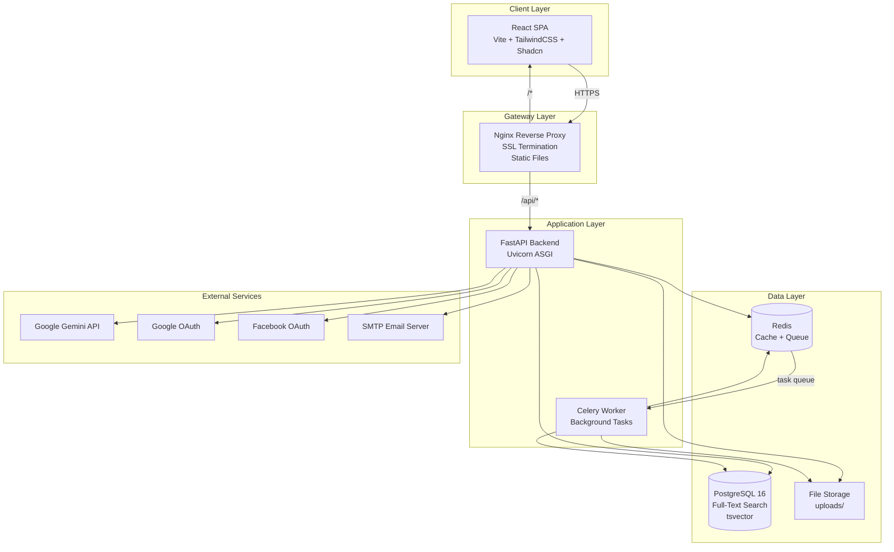
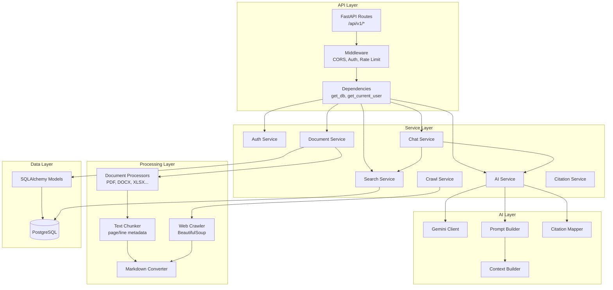
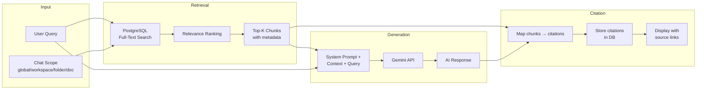
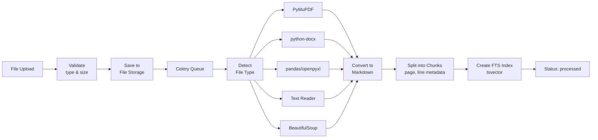
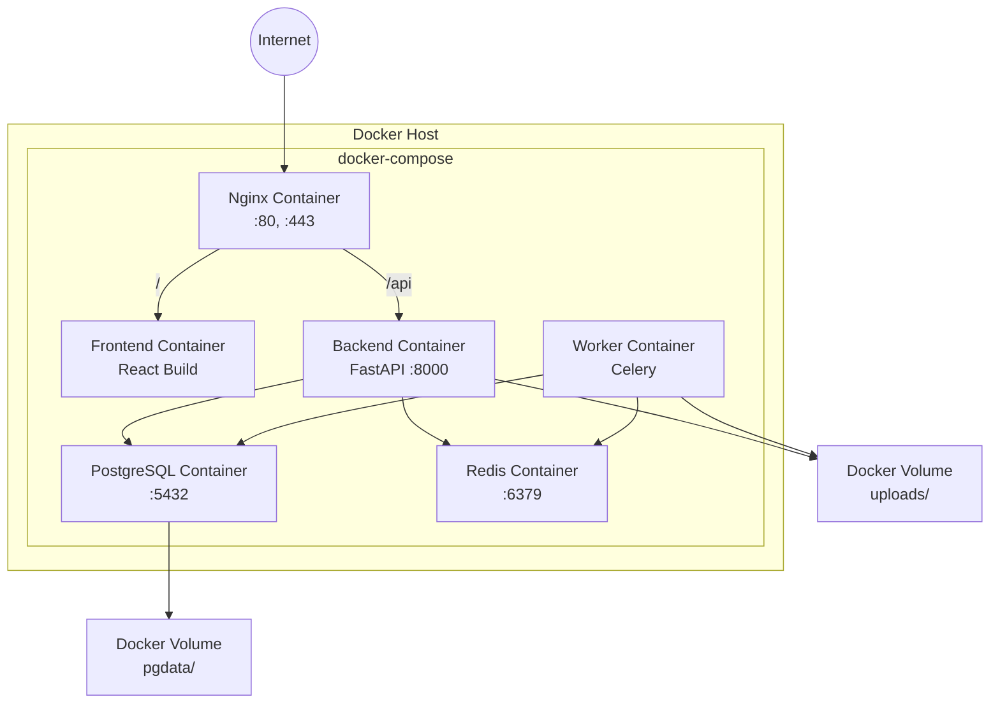
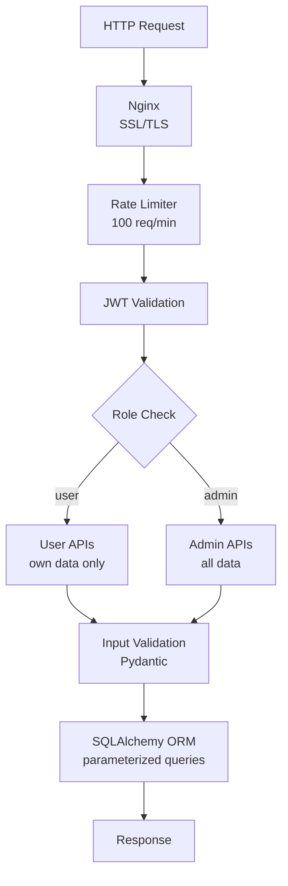

# 11. System Architecture Diagram

## 11.1 High-Level Architecture

## 11.2 Backend Architecture (Layered)

## 11.3 AI Chat Architecture (Core)

## 11.4 Document Processing Pipeline

## 11.5 Deployment Architecture (Docker)

## 11.6 Security Architecture

## 11.7 Technology Stack Summary

| Layer | Technology | Version | Purpose |
|-------|-----------|---------|---------|
| Frontend | React | 18+ | UI framework |
| Build | Vite | 5+ | Fast dev build |
| Styling | TailwindCSS | 3+ | Utility CSS |
| UI Components | Shadcn UI | latest | Component library |
| State | React Query + Zustand | latest | Server + client state |
| Routing | React Router | 6+ | SPA routing |
| HTTP | Axios | latest | API client |
| Backend | FastAPI | 0.100+ | Async API framework |
| ORM | SQLAlchemy | 2.0+ | Database ORM |
| Validation | Pydantic | 2.0+ | Schema validation |
| Auth | python-jose + passlib | latest | JWT + bcrypt |
| Database | PostgreSQL | 16 | Primary database |
| Queue | Celery + Redis | latest | Background tasks |
| AI | google-generativeai | latest | Gemini API |
| PDF | PyMuPDF (fitz) | latest | PDF extraction |
| DOCX | python-docx | latest | Word extraction |
| Web | BeautifulSoup4 | latest | HTML parsing |
| Proxy | Nginx | latest | Reverse proxy |
| Container | Docker + Compose | latest | Deployment |
