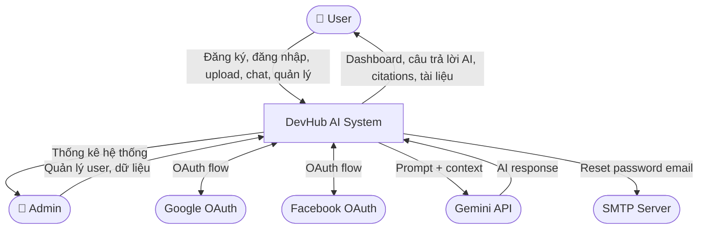
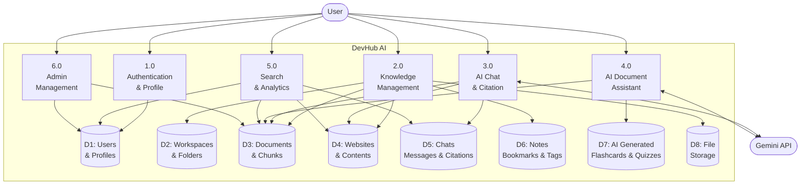
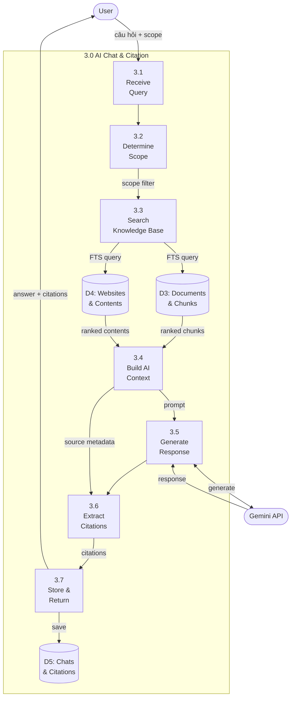
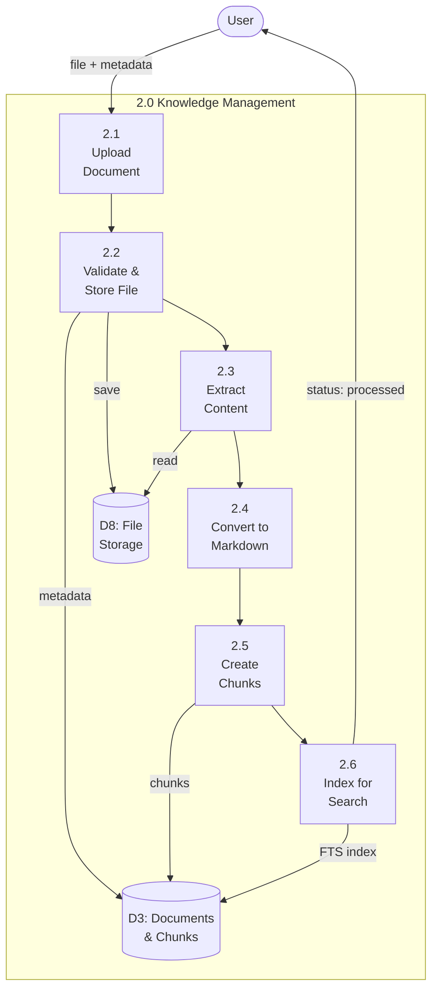
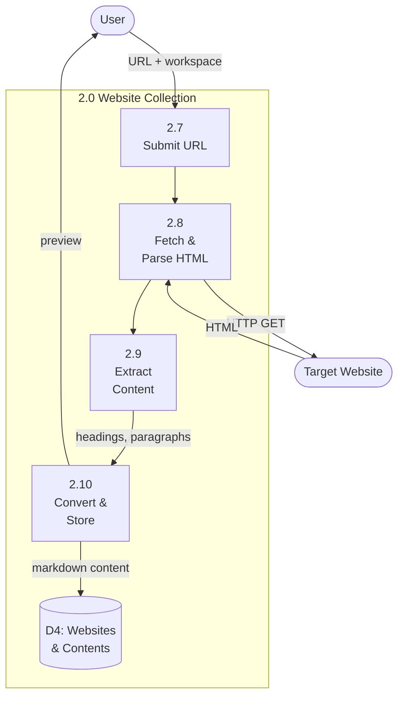
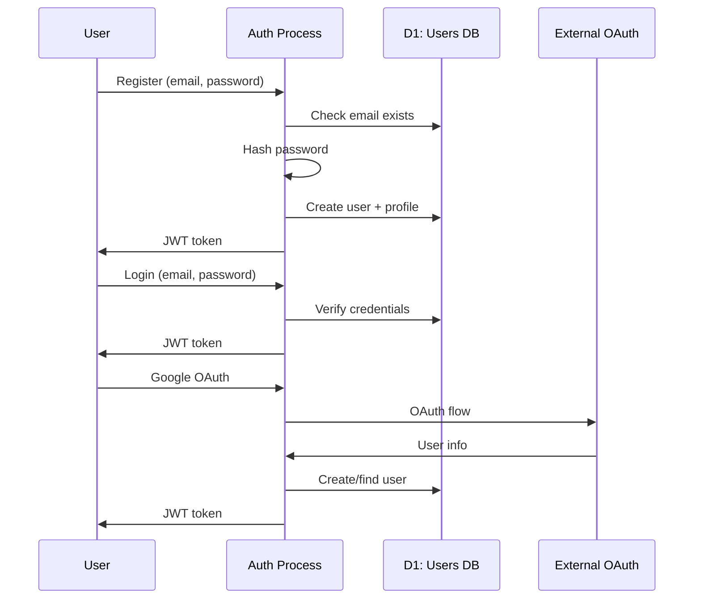

# 12. Data Flow Diagram (DFD)

## 12.1 DFD Level 0 — Context Diagram

## 12.2 DFD Level 1 — Main Processes

## 12.3 DFD Level 2 — AI Chat Process (3.0)

## 12.4 DFD Level 2 — Document Processing (2.0)

## 12.5 DFD Level 2 — Website Crawling

## 12.6 Data Flow — Authentication

## 12.7 Data Store Dictionary

| ID | Tên | Mô tả | Entities |
|----|-----|-------|----------|
| D1 | Users & Profiles | Thông tin tài khoản | users, user_profiles |
| D2 | Workspaces & Folders | Cấu trúc tổ chức | workspaces, folders |
| D3 | Documents & Chunks | Tài liệu và nội dung đã xử lý | documents, document_chunks |
| D4 | Websites & Contents | Website đã crawl | websites, website_contents |
| D5 | Chats & Citations | Hội thoại AI và trích dẫn | chats, chat_messages, citations |
| D6 | Notes & Bookmarks | Ghi chú và đánh dấu | notes, bookmarks, tags |
| D7 | AI Generated | Nội dung AI sinh ra | flashcards, quizzes |
| D8 | File Storage | File gốc upload | uploads/documents/, uploads/avatars/ |

## 12.8 Data Flow Summary Table

| Process | Input | Output | Data Stores |
|---------|-------|--------|-------------|
| 1.0 Auth | email, password, OAuth token | JWT, user profile | D1 |
| 2.1 Upload Doc | file, workspace_id | document metadata | D3, D8 |
| 2.3 Extract | file from storage | text content | D8 → D3 |
| 2.7 Crawl Web | URL | markdown content | D4 |
| 3.3 Search KB | query, scope | ranked chunks | D3, D4 |
| 3.5 AI Generate | prompt + context | AI response | Gemini → D5 |
| 3.6 Citation | response + chunks | citation records | D5 |
| 4.0 AI Doc Assist | document_id, action | summary/flashcard/quiz | D3 → D7 |
| 5.0 Search | query, filters | grouped results | D1-D6 |
| 6.0 Admin | admin commands | system stats | D1-D5 |
