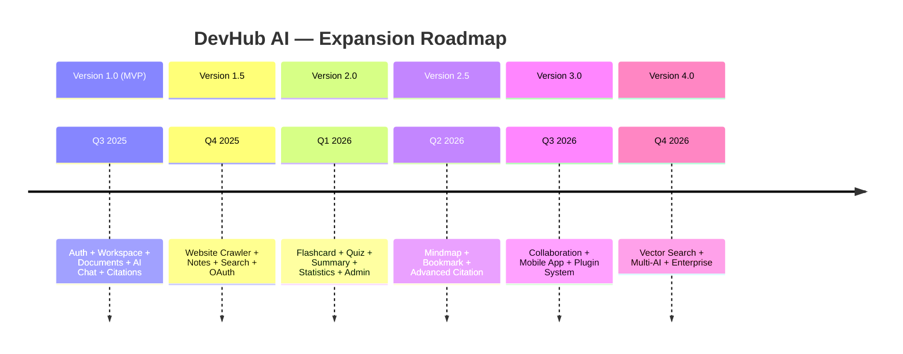
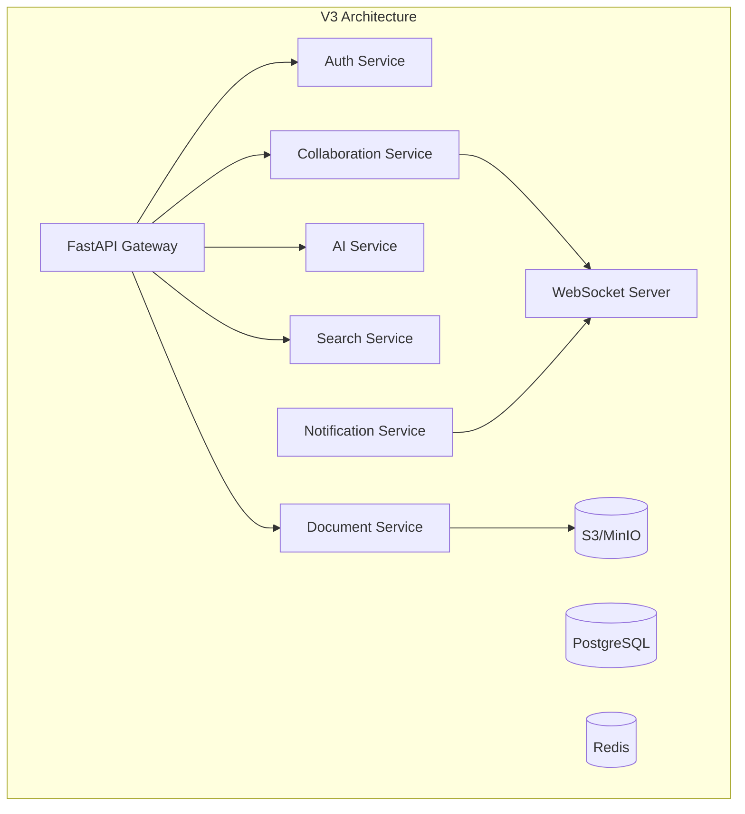

# 15. Future Expansion Plan

## 15.1 Roadmap tổng quan

---

## 15.2 Version 1.5 — Knowledge Expansion

**Timeline:** Q4 2025 (sau MVP 4 tuần)

| Feature | Mô tả | Priority |
|---------|-------|----------|
| Website Crawler | Crawl URL, extract content, save as Markdown | High |
| Notes Module | Markdown editor, link to workspace/folder/document | High |
| Global Search | Cross-entity search with filters | High |
| Google OAuth | Social login | Medium |
| Facebook OAuth | Social login | Low |
| Forgot Password | Email reset flow | Medium |
| Tag System | Create, assign, filter by tags | Medium |
| More file types | PPTX, XLSX, CSV, JSON, HTML | Medium |

### Technical Additions
- `websites`, `website_contents` tables
- `notes`, `tags`, `bookmarks` tables
- BeautifulSoup4 web crawler service
- Additional document processors
- Unified search API endpoint

---

## 15.3 Version 2.0 — AI Power Features

**Timeline:** Q1 2026

| Feature | Mô tả | Priority |
|---------|-------|----------|
| AI Summary | Tóm tắt tài liệu tự động | High |
| Flashcard Generator | Sinh Q&A cards từ tài liệu | High |
| Quiz Generator | Sinh trắc nghiệm từ tài liệu | High |
| Keyword Extraction | Trích xuất từ khóa tự động | Medium |
| AI Notes | Sinh ghi chú học tập | Medium |
| Statistics Page | Charts, top documents, AI usage | High |
| Admin Panel | User management, system stats | High |
| Folder/Document Chat | Scoped chat modes | Medium |
| Citation Jump | Mở tài liệu gốc, nhảy đến trang | High |

### Technical Additions
- `flashcards`, `quizzes` tables
- AI prompt templates library
- Recharts integration
- Admin role middleware
- PDF page navigation component

---

## 15.4 Version 2.5 — Enhanced Experience

**Timeline:** Q2 2026

| Feature | Mô tả | Priority |
|---------|-------|----------|
| Mindmap Generator | Sinh mindmap từ tài liệu | Medium |
| Bookmark System | Đánh dấu yêu thích | Medium |
| Spaced Repetition | Ôn flashcard theo lịch SM-2 | Medium |
| Export Features | Export notes/quiz to PDF/Anki | Low |
| Folder Nesting | Multi-level folder hierarchy | Medium |
| Drag & Drop | Reorder folders, move documents | Medium |
| Notification System | Processing complete, daily digest | Low |
| Keyboard Shortcuts | Power user shortcuts | Low |

---

## 15.5 Version 3.0 — Collaboration & Platform

**Timeline:** Q3 2026

### 3.1 Team Collaboration

| Feature | Mô tả |
|---------|-------|
| Shared Workspaces | Chia sẻ workspace với team members |
| Role-based Access | Owner, Editor, Viewer permissions |
| Real-time Notes | Collaborative markdown editing |
| Comment System | Comment trên documents |
| Activity Feed | Theo dõi hoạt động team |

### 3.2 Mobile Application

| Feature | Mô tả |
|---------|-------|
| React Native App | iOS + Android |
| Offline Mode | Cache documents for offline reading |
| Push Notifications | Chat responses, processing alerts |
| Camera Upload | Scan documents via camera |
| Voice Input | Voice-to-text cho AI chat |

### 3.3 Plugin System

| Feature | Mô tả |
|---------|-------|
| Browser Extension | Save web pages directly to DevHub |
| VS Code Extension | Save code snippets, docs from IDE |
| API Webhooks | Integrate with external tools |
| Import/Export | Notion, Obsidian, Anki import |

### Technical Architecture Changes

---

## 15.6 Version 4.0 — Enterprise & Advanced AI

**Timeline:** Q4 2026

### 4.1 Hybrid Search (Markdown + Vector)

| Feature | Mô tả |
|---------|-------|
| Optional Vector Search | pgvector extension cho semantic search |
| Hybrid Retrieval | Kết hợp FTS + vector search |
| Re-ranking | Cross-encoder re-ranking results |
| Chunk Optimization | Smart chunking với overlap |

> **Lưu ý:** Chỉ thêm vector search khi FTS không đủ chất lượng. Hệ thống vẫn ưu tiên source tracking.

### 4.2 Multi-AI Provider

| Provider | Use Case |
|----------|----------|
| Gemini | Default — chat, summary, generation |
| OpenAI GPT | Alternative cho complex reasoning |
| Claude | Long document analysis |
| Local LLM | Privacy-sensitive data (Ollama) |

### 4.3 Enterprise Features

| Feature | Mô tả |
|---------|-------|
| SSO/SAML | Enterprise single sign-on |
| Audit Logs | Full activity logging |
| Data Retention | Configurable retention policies |
| Custom Branding | White-label option |
| SLA Monitoring | Uptime guarantees |
| On-premise Deploy | Self-hosted option |
| API Rate Plans | Tiered API access |

---

## 15.7 AI Evolution Roadmap

```mermaid
graph LR
    subgraph V1 MVP
        A1[FTS Search] --> A2[Gemini Flash]
        A2 --> A3[Basic Citations]
    end
    
    subgraph V2
        B1[Improved Prompts] --> B2[Multi-doc Context]
        B2 --> B3[Citation Jump]
    end
    
    subgraph V3
        C1[Agentic RAG] --> C2[Multi-step Reasoning]
        C2 --> C3[Auto Knowledge Graph]
    end
    
    subgraph V4
        D1[Hybrid Search] --> D2[Multi-AI Router]
        D2 --> D3[Fine-tuned Models]
    end
    
    A3 --> B1
    B3 --> C1
    C3 --> D1
```

| Version | AI Capability | Model |
|---------|--------------|-------|
| V1 | Q&A với citation | Gemini 1.5 Flash |
| V2 | Summary, Flashcard, Quiz generation | Gemini 1.5 Pro |
| V3 | Multi-step research agent | Gemini 2.0 + Tools |
| V4 | Hybrid retrieval + multi-model | Router pattern |

---

## 15.8 Scalability Plan

| Stage | Users | Infrastructure |
|-------|-------|----------------|
| MVP | < 100 | Single server, Docker Compose |
| V1.5 | < 1,000 | Separate DB server, Redis cache |
| V2.0 | < 10,000 | Load balancer, multiple API instances |
| V3.0 | < 100,000 | Kubernetes, CDN, S3 storage |
| V4.0 | 100,000+ | Multi-region, read replicas, message queue |

### Database Scaling Strategy

| Stage | Strategy |
|-------|----------|
| < 10K users | Single PostgreSQL instance |
| 10K-100K | Read replicas, connection pooling (PgBouncer) |
| 100K+ | Table partitioning (document_chunks by user_id), archiving |
| 1M+ | Sharding by user_id, separate search index |

---

## 15.9 Monetization Plan (Future)

| Tier | Giá | Features |
|------|-----|----------|
| **Free** | $0 | 3 workspaces, 50 documents, 100 AI queries/month |
| **Pro** | $9/month | Unlimited workspaces, 500 documents, 1000 AI queries |
| **Team** | $19/user/month | Shared workspaces, collaboration, 5000 AI queries |
| **Enterprise** | Custom | SSO, on-premise, unlimited, SLA |

---

## 15.10 Risk & Technical Debt Management

| Area | Risk | Mitigation Plan |
|------|------|-----------------|
| FTS quality | Search không chính xác với câu hỏi phức tạp | V4: thêm optional vector search |
| Gemini dependency | Single AI provider lock-in | V4: multi-AI router |
| File storage | Local storage không scale | V3: migrate to S3/MinIO |
| Background processing | FastAPI BackgroundTasks giới hạn | V1.5: migrate to Celery |
| No offline support | Phụ thuộc internet | V3: mobile offline mode |
| Citation hallucination | AI trích dẫn sai nguồn | Strict prompt + validation pipeline |

---

## 15.11 Community & Ecosystem

| Initiative | Timeline | Mô tả |
|------------|----------|-------|
| Open API | V2.0 | Public API cho third-party integrations |
| Template Library | V2.5 | Shared workspace templates (Python, React, ...) |
| Community Forum | V3.0 | User community, feature requests |
| Open Source Core | V3.0 | Open source core, premium features |
| Developer SDK | V3.0 | Python/JS SDK cho integrations |
| Marketplace | V4.0 | Plugin marketplace |

---

## 15.12 Success Metrics by Version

| Version | Key Metric | Target |
|---------|-----------|--------|
| V1 (MVP) | Working demo | 1 complete user flow |
| V1.5 | Beta users | 50 active users |
| V2.0 | Feature complete | 500 active users |
| V2.5 | User retention | 60% monthly retention |
| V3.0 | Platform growth | 5,000 active users |
| V4.0 | Revenue | 100 paying customers |
