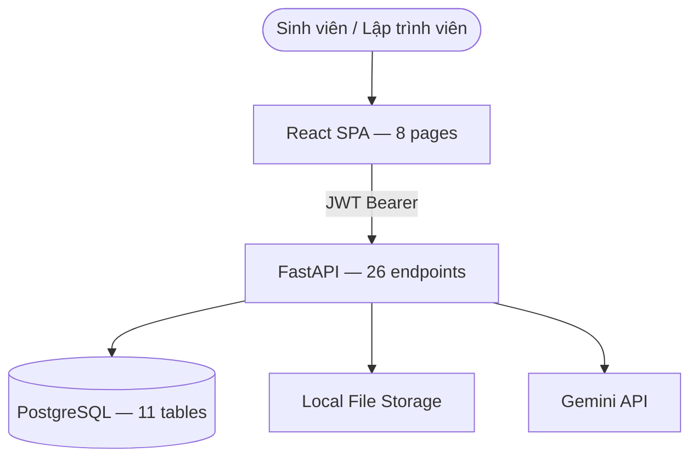
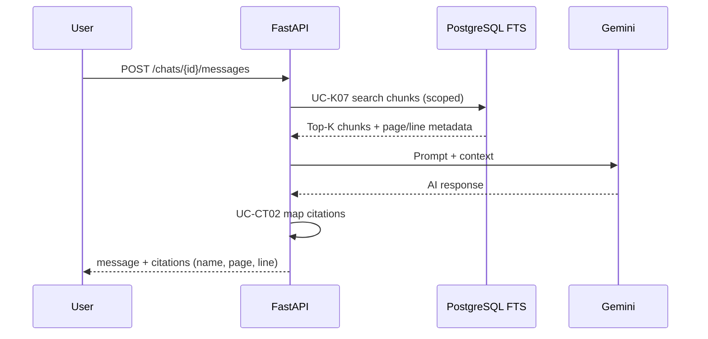
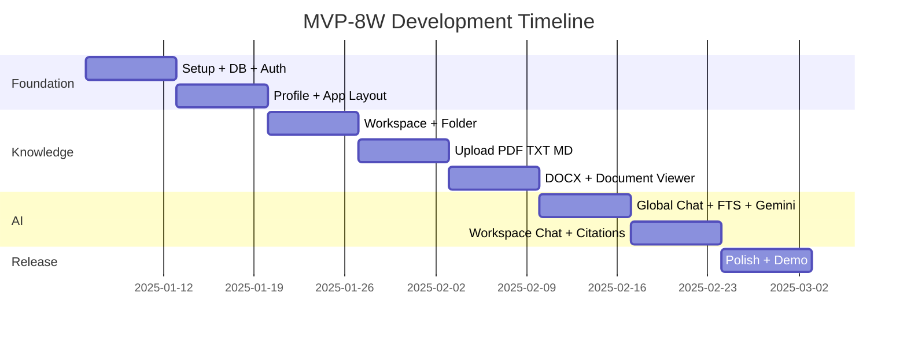

# 17. Revised MVP Architecture — DevHub AI

**Phiên bản:** 1.1  
**Ngày:** 23/06/2025  
**Trạng thái:** P0 fixes applied — **MVP-8W là mục tiêu triển khai chính thức**

---

## Executive Summary

| Metric | Full Product (v1.0) | **MVP-8W (Official)** |
|--------|---------------------|------------------------|
| **Pages** | 21 | **8** |
| **API endpoints** | ~65 | **26** |
| **Database tables** | 19 (+ junctions) | **11** |
| **Timeline** | 20 tuần | **8 tuần** |
| **Use Cases** | 50+ | **32** (28 user + 4 system) |
| **Team** | 6+ người | **3–4 SV** |

---

## 1. P0 Fixes Applied

### 1.1 Database (`06-Database-Schema.sql` v1.1)

| Fix | Mô tả | Trạng thái |
|-----|-------|------------|
| Citations schema | Thêm `note_id` FK + CHECK constraints theo `source_type` | ✅ |
| Refresh tokens | Bảng `refresh_tokens` (UC-A04, NFR-02.1) | ✅ |
| Notes FTS trigger | `trg_note_search_vector` trên `notes` | ✅ |
| Workspace/Folder/Document consistency | `validate_document_folder_workspace()` trigger | ✅ |
| Folder move cascade | `cascade_folder_workspace_change()` trigger | ✅ |
| OAuth unique | Partial unique index `(oauth_provider, oauth_id)` | ✅ |
| Chat mode constraints | CHECK workspace/folder/document_id theo mode | ✅ |

### 1.2 Use Case Standardization

Tạo **[00-Use-Case-Master.md](./00-Use-Case-Master.md)** — nguồn sự thật duy nhất.

| Prefix | Module | MVP Count |
|--------|--------|-----------|
| UC-A | Authentication | 4 |
| UC-P | Profile | 2 |
| UC-W | Workspace | 5 |
| UC-F | Folder | 4 |
| UC-K | Document + FTS | 7 |
| UC-C | AI Chat | 7 |
| UC-CT | Citation | 2 |

**Đã cập nhật:** `01-SRS.md`, `02-Use-Case-Diagram.md`, `07-API-Design.md`, `14-MVP-Version.md`

### 1.3 MVP Scope Locked

MVP-8W **chỉ** gồm các module user yêu cầu — mọi tài liệu khác đánh dấu Post-MVP.

---

## 2. MVP-8W Architecture

### 2.1 System Context



### 2.2 Core Data Flow — AI Chat with Citation



### 2.3 Technology Stack (MVP)

| Layer | Technology |
|-------|------------|
| Frontend | React 18, Vite, TailwindCSS, Shadcn UI, React Query, Axios |
| Backend | Python 3.11+, FastAPI, SQLAlchemy, Pydantic |
| Database | PostgreSQL 16 (`tsvector`, GIN index) |
| Auth | JWT (24h) + refresh token (7d) |
| AI | Gemini 1.5 Flash |
| Documents | PyMuPDF (PDF), python-docx (DOCX), plain read (TXT/MD) |
| Deploy | Docker Compose (db + api + frontend) |

---

## 3. MVP-8W Scope Detail

### 3.1 Authentication — UC-A01 ~ UC-A04

| Feature | API | DB |
|---------|-----|-----|
| Register | `POST /auth/register` | users, user_profiles |
| Login | `POST /auth/login` | refresh_tokens |
| Logout + popup | `POST /auth/logout` | refresh_tokens.revoked_at |
| Refresh | `POST /auth/refresh` | refresh_tokens |

### 3.2 Profile — UC-P01 ~ UC-P02

| Feature | API |
|---------|-----|
| View profile | `GET /users/me` |
| Update profile | `PUT /users/me` |

### 3.3 Knowledge Management

| Feature | UC | Files |
|---------|-----|-------|
| Workspace CRUD | UC-W01~W05 | — |
| Folder CRUD | UC-F01~F04 | — |
| Upload | UC-K01 | PDF, DOCX, TXT, MD |
| Document Viewer | UC-K03, K04 | Markdown render + PDF iframe |
| Delete | UC-K05 | — |

### 3.4 AI Features

| Feature | UC | chat_mode |
|---------|-----|-----------|
| Global Chat | UC-C06 | `global` |
| Workspace Chat | UC-C07 | `workspace` |
| Chat history | UC-C01~C05 | — |
| Citations | UC-CT01~CT02 | — |

**Citation response fields (bắt buộc):**

```json
{
  "source_name": "React_Hooks_Guide.pdf",
  "source_type": "document",
  "page_number": 5,
  "line_start": 120,
  "line_end": 145
}
```

### 3.5 Search — UC-K07

PostgreSQL Full-Text Search trên `document_chunks.search_vector`:

```sql
SELECT * FROM document_chunks
WHERE search_vector @@ plainto_tsquery('simple', :query)
  AND document_id IN (SELECT id FROM documents WHERE user_id = :uid ...)
ORDER BY ts_rank(search_vector, plainto_tsquery('simple', :query)) DESC
LIMIT 10;
```

### 3.6 Explicitly Excluded

Google OAuth · Facebook OAuth · Website Collector · Notes · Bookmark · Flashcard · Quiz · Mindmap · Statistics · Admin Panel · Dashboard · Global Search UI · Forgot Password

---

## 4. Pages (8)

| # | Page | Route | Components chính |
|---|------|-------|------------------|
| 1 | Login | `/login` | AuthLayout, LoginForm |
| 2 | Register | `/register` | AuthLayout, RegisterForm |
| 3 | Workspace List | `/workspaces` | WorkspaceCard, CreateDialog |
| 4 | Workspace Detail | `/workspaces/:id` | FolderList, DocumentList, FileUpload |
| 5 | Document Viewer | `/documents/:id` | MarkdownPreview, PdfViewer |
| 6 | AI Chat | `/chat`, `/chat/:id` | ChatSidebar, ChatWindow, CitationList |
| 7 | Profile | `/profile` | ProfileForm |
| 8 | Landing | `/` | Hero (optional) |

---

## 5. API Endpoints (26)

Xem chi tiết tại [07-API-Design.md §7.0](./07-API-Design.md)

| Nhóm | Count |
|------|-------|
| Auth | 4 |
| Profile | 2 |
| Workspace | 5 |
| Folder | 4 |
| Document | 5 |
| Chat | 6 |
| **Total** | **26** |

---

## 6. Database Tables (11 — MVP)

```sql
-- MVP-8W core tables
users
user_profiles
refresh_tokens      -- P0: UC-A04
workspaces
folders
documents
document_chunks     -- FTS + citation metadata
chats
chat_messages
citations           -- P0: note_id + CHECK constraints
ai_usage_logs       -- track AI queries
```

**Post-MVP tables** (có trong full schema, không migrate cho MVP):  
`tags`, `document_tags`, `websites`, `website_contents`, `notes`, `note_tags`, `flashcards`, `quizzes`, `bookmarks`

---

## 7. Development Timeline (8 tuần)



| Tuần | Milestone | UC hoàn thành |
|------|-----------|---------------|
| 1 | Auth working | UC-A01~A04 |
| 2 | Layout + Profile | UC-P01~P02 |
| 3 | Workspace/Folder UI | UC-W01~W05, UC-F01~F04 |
| 4 | Upload + process | UC-K01, UC-K06 |
| 5 | Viewer | UC-K02~K04 |
| 6 | Global Chat | UC-C01~C06, UC-K07 |
| 7 | WS Chat + Citations | UC-C07, UC-CT01~CT02 |
| 8 | **MVP Demo Ready** | All MVP UCs |

---

## 8. Document Package Index (Revised)

| # | Document | Version | Status |
|---|----------|---------|--------|
| 00 | Use Case Master | 1.1 | **NEW** |
| 01 | SRS | 1.1 | Updated |
| 02 | Use Case Diagram | 1.1 | Updated |
| 03 | Activity Diagram | 1.0 | Reference |
| 04 | Sequence Diagram | 1.0 | Reference |
| 05 | ERD | 1.1 | Updated |
| 06 | Database Schema | 1.1 | **P0 fixed** |
| 07 | API Design | 1.1 | Updated |
| 08 | Frontend Structure | 1.1 | Updated |
| 09 | Backend Structure | 1.0 | Reference |
| 10 | UI/UX Wireframe | 1.0 | Reference (MVP subset) |
| 11 | System Architecture | 1.0 | Reference |
| 12 | Data Flow Diagram | 1.0 | Reference |
| 13 | Development Roadmap | 1.0 | Superseded by §7 |
| 14 | MVP Version | 1.1 | **MVP-8W official** |
| 15 | Future Expansion | 1.0 | Post-MVP |
| 16 | Architecture Review | 1.0 | Historical |
| 17 | Revised MVP Architecture | 1.1 | **This document** |

---

## 9. Traceability Matrix (MVP-8W)

| FR (SRS) | UC | API | Page | DB Table |
|----------|-----|-----|------|----------|
| FR-01.1~01.3, 01.6~01.7 | UC-A01~A03 | `/auth/*` | Login, Register | users |
| NFR-02.1 | UC-A04 | `/auth/refresh` | — | refresh_tokens |
| FR-02.1~02.2 | UC-P01~P02 | `/users/me` | Profile | user_profiles |
| FR-04.1~04.3 | UC-W01~W05 | `/workspaces/*` | Workspaces | workspaces |
| FR-05.1 | UC-F01~F04 | `/folders/*` | Workspace Detail | folders |
| FR-06.1~06.5 | UC-K01~K07 | `/documents/*` | Workspace Detail, Viewer | documents, document_chunks |
| FR-08.1~08.3, 08.6~08.7 | UC-C01~C07 | `/chats/*` | Chat | chats, chat_messages |
| FR-09.1~09.2, 09.4 | UC-CT01~CT02 | (in messages response) | Chat | citations |

---

## 10. Post-MVP Roadmap (tóm tắt)

| Phase | Timeline | Features |
|-------|----------|----------|
| v1.5 | +4 tuần | Website, Notes, Global Search, OAuth |
| v2.0 | +6 tuần | AI Doc (Flashcard/Quiz), Statistics, Admin |
| v2.5 | +4 tuần | Bookmark, Citation jump, Dashboard charts |
| v3.0 | +8 tuần | Collaboration, Mobile |

Chi tiết: [15-Future-Expansion.md](./15-Future-Expansion.md)

---

## 11. Implementation Checklist

### Week 1 kickoff

- [ ] Run `06-Database-Schema.sql` (11 MVP tables minimum)
- [ ] Implement UC-A01~A04 per `07-API-Design.md §7.0`
- [ ] Scaffold React routes per `08-Frontend-Structure.md` MVP section
- [ ] Configure Gemini API key in `.env`
- [ ] Lock scope — no post-MVP features until week 8 demo

### Definition of Done (MVP)

- [ ] Demo script §14.9 in `14-MVP-Version.md` passes
- [ ] All 26 API endpoints documented and tested
- [ ] Citations show file name + page + line on every AI response with sources
- [ ] FTS used for retrieval (not vector DB)
- [ ] Logout shows confirmation dialog (FR-01.7)

---

## Appendix — Quick Reference Card

```
MVP-8W AT A GLANCE
──────────────────
Pages:     8
APIs:      26
DB Tables: 11
Weeks:     8
UCs:       32
Files:     PDF, DOCX, TXT, MD
Chat:      Global + Workspace
Search:    PostgreSQL FTS (internal)
Citation:  source_name + page_number + line_start/end
Excluded:  OAuth, Website, Notes, Bookmark, AI Doc, Stats, Admin
```
