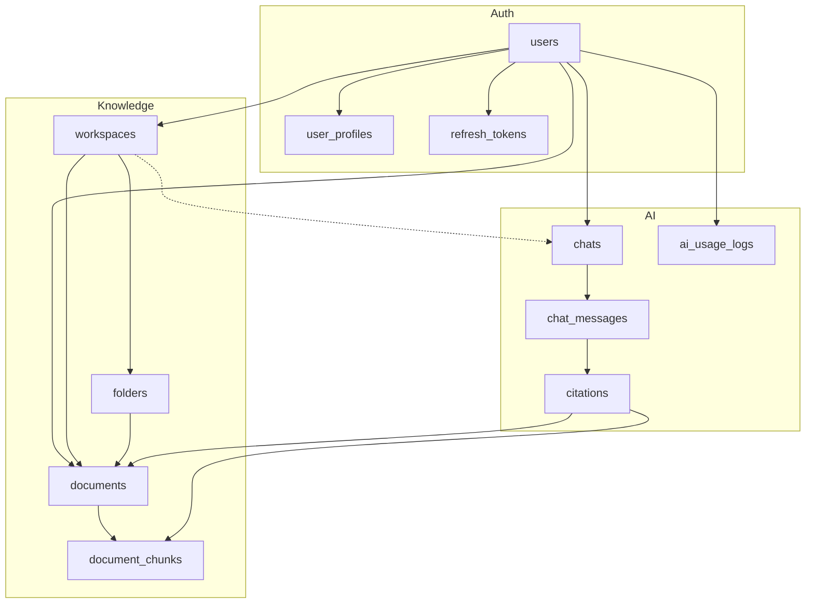
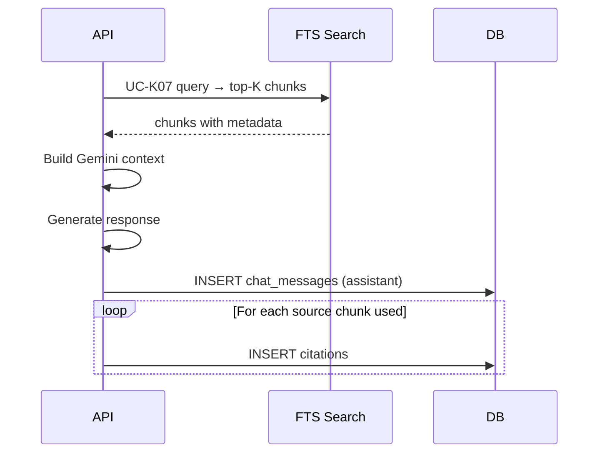
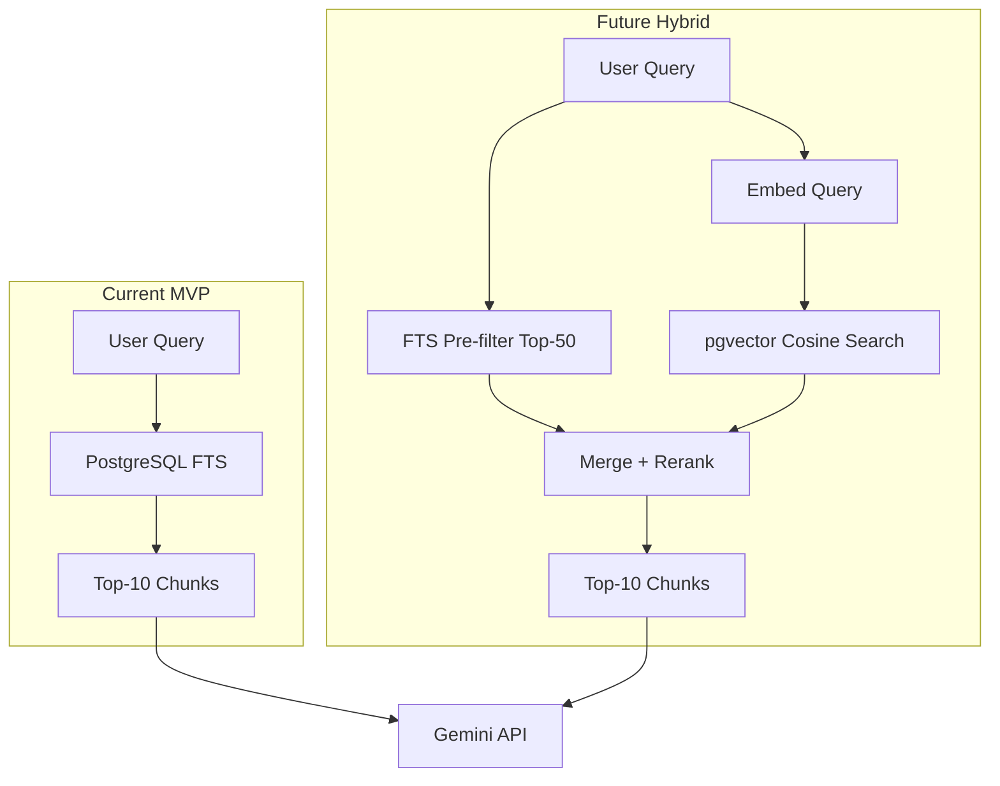

# 18. Final Production Database — DevHub AI MVP-8W

**Phiên bản:** 1.0  
**Ngày:** 23/06/2025  
**Phạm vi:** Production schema cho MVP-8W (11 bảng core)  
**Schema file:** [06-Database-Schema.sql](./06-Database-Schema.sql) (full product)  
**Kiến trúc:** [17-Revised-MVP-Architecture.md](./17-Revised-MVP-Architecture.md)

---

## Executive Summary

| Hạng mục | Kết luận |
|----------|----------|
| Normalization | **3NF** với 3 denormalization có chủ đích (chấp nhận được) |
| Relationships | **Hợp lệ** — triggers bảo vệ workspace/folder/document consistency |
| Citation | **Snapshot + FK** — hiển thị ổn định, truy vết qua `chunk_id` |
| Chunking | **Heading-aware, 800–1200 tokens/chunk**, metadata page/line bắt buộc |
| FTS | **GIN + weighted tsvector + scoped JOIN** — đủ cho MVP, không cần Elasticsearch |
| Production readiness | **Sẵn sàng** sau khi áp dụng §8 Recommended DDL patches |

---

## 1. Table Inventory & Review

### 1.1 MVP-8W Core Tables (11) — Production Target

| # | Table | Rows (ước lượng/user) | Vai trò | MVP |
|---|-------|------------------------|---------|-----|
| 1 | `users` | 1 | Identity, auth credentials | ✓ |
| 2 | `user_profiles` | 1 | Profile attributes (1:1) | ✓ |
| 3 | `refresh_tokens` | 1–5 | Session refresh (UC-A04) | ✓ |
| 4 | `workspaces` | 3–10 | Knowledge namespace | ✓ |
| 5 | `folders` | 5–30 | Sub-organization (1 level UI) | ✓ |
| 6 | `documents` | 20–200 | Uploaded file metadata | ✓ |
| 7 | `document_chunks` | 200–5,000 | Searchable content + citation anchors | ✓ |
| 8 | `chats` | 10–50 | Conversation sessions | ✓ |
| 9 | `chat_messages` | 100–1,000 | User/assistant messages | ✓ |
| 10 | `citations` | 50–500 | Source references per assistant message | ✓ |
| 11 | `ai_usage_logs` | 100–2,000 | AI query audit / metrics | ✓ |

### 1.2 Post-MVP Tables (không deploy trong MVP-8W)

| Table | Lý do loại khỏi MVP migration |
|-------|-------------------------------|
| `tags`, `document_tags` | Tagging — post-MVP |
| `websites`, `website_contents` | Website collector — post-MVP |
| `notes`, `note_tags` | Notes module — post-MVP |
| `flashcards`, `quizzes` | AI Doc Assistant — post-MVP |
| `bookmarks` | Bookmark — post-MVP |

### 1.3 Per-Table Review

#### `users`

| Aspect | Đánh giá |
|--------|----------|
| PK | `UUID` — tốt cho distributed/API exposure |
| Unique | `email` — đúng |
| Nullable | `password_hash` NULL cho OAuth tương lai — OK |
| Cột thừa MVP | `reset_token`, `oauth_*`, `role=admin` — giữ cho forward-compat, không dùng |
| Recommendation | Giữ nguyên; MVP chỉ dùng `email`, `password_hash`, `is_active` |

#### `user_profiles`

| Aspect | Đánh giá |
|--------|----------|
| Pattern | 1:1 với `users` — tách profile khỏi auth table (đúng) |
| Unique | `user_id UNIQUE` — đảm bảo 1 profile/user |
| MVP fields | `full_name`, `gender` — đủ UC-P01/P02 |

#### `refresh_tokens`

| Aspect | Đánh giá |
|--------|----------|
| Security | Lưu `token_hash`, không lưu plain token — đúng |
| Revocation | `revoked_at` cho logout (UC-A03) — đúng |
| Cleanup | Cần cron xóa expired tokens (§9.3) |

#### `workspaces` / `folders`

| Aspect | Đánh giá |
|--------|----------|
| Hierarchy | `workspaces` → `folders` → `documents` — đúng |
| `parent_id` | Hỗ trợ nested folder — MVP UI chỉ 1 cấp, schema sẵn sàng |
| Unique | `(workspace_id, name, parent_id)` — tránh trùng tên trong cùng parent |

#### `documents`

| Aspect | Đánh giá |
|--------|----------|
| Denormalization | `user_id` + `workspace_id` — **có chủ đích** (security filter nhanh) |
| Consistency | Trigger `validate_document_folder_workspace` — **bắt buộc giữ** |
| `file_path` | Lưu relative path — không lưu binary trong DB (đúng) |
| `status` enum | `uploading → processing → processed | failed` — đủ state machine |

#### `document_chunks`

| Aspect | Đánh giá |
|--------|----------|
| Core table | **Quan trọng nhất** — FTS + citation anchor |
| Redundancy | `content` + `content_markdown` — xem §5 |
| Metadata | `page_number`, `line_start`, `line_end` — **bắt buộc MVP citation** |
| Unique | `(document_id, chunk_index)` — đúng thứ tự |

#### `chats` / `chat_messages`

| Aspect | Đánh giá |
|--------|----------|
| Scope | `chat_mode` + `workspace_id` — MVP dùng `global` và `workspace` |
| CHECK constraints | Đảm bảo `workspace_id` NOT NULL khi mode=workspace — đúng |
| `message_count` | Denormalized — có thể bỏ MVP, hoặc maintain bằng trigger |

#### `citations`

| Aspect | Đánh giá |
|--------|----------|
| MVP usage | Chỉ `source_type = 'document'` |
| Post-MVP FKs | `website_id`, `note_id` — giữ nullable, không populate MVP |
| Snapshot | `source_name`, `page_number`, `line_*`, `excerpt` — survive FK null |

#### `ai_usage_logs`

| Aspect | Đánh giá |
|--------|----------|
| Purpose | Audit `action_type` = `chat`, `token_count` |
| Partition | Cân nhắc partition by month khi > 1M rows (§9) |

---

## 2. Normalization Analysis

### 2.1 Normal Form Assessment

| Table | 1NF | 2NF | 3NF | Ghi chú |
|-------|-----|-----|-----|---------|
| users | ✓ | ✓ | ✓ | Atomic columns |
| user_profiles | ✓ | ✓ | ✓ | No transitive deps on user_id |
| refresh_tokens | ✓ | ✓ | ✓ | |
| workspaces | ✓ | ✓ | ✓ | |
| folders | ✓ | ✓ | ✓ | |
| documents | ✓ | ✓ | ⚠️ | `user_id` derivable via workspace — **intentional denorm** |
| document_chunks | ✓ | ✓ | ✓ | Depends only on document_id |
| chats | ✓ | ✓ | ✓ | |
| chat_messages | ✓ | ✓ | ✓ | |
| citations | ✓ | ✓ | ⚠️ | `source_name` derivable from document — **intentional snapshot** |
| ai_usage_logs | ✓ | ✓ | ✓ | |

**Kết luận:** Schema đạt **Third Normal Form (3NF)** với 2 ngoại lệ có chủ đích:

| Denormalization | Lý do | Rủi ro | Mitigation |
|-----------------|-------|--------|------------|
| `documents.user_id` | `WHERE user_id = ?` không cần JOIN workspace — **mọi API query đều filter user** | Drift nếu workspace đổi owner (không có feature này) | Workspace luôn thuộc `user_id`; không transfer workspace MVP |
| `citations.source_name` | Hiển thị citation khi document bị xóa (`ON DELETE SET NULL`) | Stale name nếu document rename | Acceptable — citation là historical record |
| `chats.message_count` | Tránh COUNT(*) mỗi list | Drift | Trigger maintain hoặc bỏ cột MVP |

### 2.2 Không nên chuẩn hóa thêm

- **Không tách** `document_chunks` ra file storage — cần FTS trong DB
- **Không gộp** `chat_messages` + `citations` vào JSONB — mất queryability cho citation list
- **Không gộp** `users` + `user_profiles` — profile optional, OAuth future

---

## 3. Final ERD — MVP-8W Production

```mermaid
erDiagram
    users ||--o| user_profiles : "1:1 has"
    users ||--o{ refresh_tokens : "1:N has"
    users ||--o{ workspaces : "1:N owns"
    users ||--o{ documents : "1:N owns"
    users ||--o{ chats : "1:N creates"
    users ||--o{ ai_usage_logs : "1:N generates"

    workspaces ||--o{ folders : "1:N contains"
    workspaces ||--o{ documents : "1:N contains"
    workspaces ||--o{ chats : "0:N scopes"

    folders ||--o{ documents : "0:N contains"

    documents ||--o{ document_chunks : "1:N split_into"

    chats ||--o{ chat_messages : "1:N contains"
    chat_messages ||--o{ citations : "1:N has"

    citations }o--|| documents : "N:1 cites (nullable)"
    citations }o--|| document_chunks : "N:1 anchor (nullable)"

    users {
        uuid id PK
        varchar email UK
        varchar password_hash
        boolean is_active
        timestamptz created_at
    }

    user_profiles {
        uuid id PK
        uuid user_id FK_UK
        varchar full_name
        gender_type gender
    }

    refresh_tokens {
        uuid id PK
        uuid user_id FK
        varchar token_hash UK
        timestamptz expires_at
        timestamptz revoked_at
    }

    workspaces {
        uuid id PK
        uuid user_id FK
        varchar name
        varchar color
        varchar icon
    }

    folders {
        uuid id PK
        uuid workspace_id FK
        uuid parent_id FK
        varchar name
        int sort_order
    }

    documents {
        uuid id PK
        uuid user_id FK
        uuid workspace_id FK
        uuid folder_id FK
        varchar title
        varchar file_name
        varchar file_type
        document_status status
        varchar file_path
    }

    document_chunks {
        uuid id PK
        uuid document_id FK
        int chunk_index UK_with_doc
        text content_markdown
        int page_number
        int line_start
        int line_end
        varchar heading
        tsvector search_vector
    }

    chats {
        uuid id PK
        uuid user_id FK
        uuid workspace_id FK
        chat_mode chat_mode
        varchar title
    }

    chat_messages {
        uuid id PK
        uuid chat_id FK
        message_role role
        text content
        int token_count
    }

    citations {
        uuid id PK
        uuid message_id FK
        uuid document_id FK
        uuid chunk_id FK
        varchar source_name
        citation_source_type source_type
        int page_number
        int line_start
        int line_end
        text excerpt
    }

    ai_usage_logs {
        uuid id PK
        uuid user_id FK
        varchar action_type
        int token_count
        timestamptz created_at
    }
```

### Cardinality Summary

| Relationship | Cardinality | ON DELETE |
|--------------|-------------|-----------|
| users → user_profiles | 1:1 | CASCADE |
| users → refresh_tokens | 1:N | CASCADE |
| users → workspaces | 1:N | CASCADE |
| workspaces → folders | 1:N | CASCADE |
| workspaces → documents | 1:N | CASCADE |
| folders → documents | 1:N | SET NULL (folder_id) |
| documents → document_chunks | 1:N | CASCADE |
| chats → chat_messages | 1:N | CASCADE |
| chat_messages → citations | 1:N | CASCADE |
| citations → documents | N:1 | SET NULL |
| citations → document_chunks | N:1 | SET NULL |

---

## 4. Relationship Explanation

### 4.1 Ownership Chain

```
users
  └── workspaces (user_id)
        ├── folders (workspace_id)
        │     └── documents (folder_id, workspace_id)  ← dual FK + trigger
        └── documents (workspace_id, folder_id NULL ok)
```

**Quy tắc nghiệp vụ:**

1. Mọi `document` **phải** thuộc một `workspace`
2. `folder_id` **tùy chọn** — document có thể nằm trực tiếp trong workspace
3. Nếu `folder_id` NOT NULL → folder.workspace_id **phải bằng** document.workspace_id (trigger)

### 4.2 Chat Scoping

```
chats.chat_mode = 'global'    → workspace_id IS NULL
chats.chat_mode = 'workspace' → workspace_id NOT NULL (CHECK)
```

FTS query khi chat:

```sql
-- Global: all user's processed documents
WHERE d.user_id = :uid AND d.status = 'processed'

-- Workspace: documents in workspace only
WHERE d.user_id = :uid AND d.workspace_id = :ws_id AND d.status = 'processed'
```

### 4.3 Citation Lineage

```
chat_messages (assistant)
  └── citations[]
        ├── chunk_id  → document_chunks (page, line, excerpt source)
        ├── document_id → documents (file_name → source_name)
        └── snapshot: source_name, page_number, line_start, line_end, excerpt
```

**Tại sao cần cả `chunk_id` VÀ snapshot columns?**

| Approach | Ưu | Nhược |
|----------|-----|-------|
| Chỉ FK `chunk_id` | Normalized | Document xóa → mất citation display |
| Chỉ snapshot | Stable display | Không link được viewer (post-MVP) |
| **FK + snapshot (chọn)** | Display ổn định + truy vết khi còn tồn tại | Vài bytes redundant |

### 4.4 Referential Integrity Diagram



---

## 5. Document Chunking Strategy

### 5.1 Design Principles

| Principle | Mô tả |
|-----------|-------|
| **Citation-first** | Mỗi chunk phải có `page_number`, `line_start`, `line_end` sau khi extract |
| **Heading-aware** | Ưu tiên split tại `# heading` / DOCX heading styles |
| **Fixed target size** | 800–1,200 tokens (~3,200–4,800 chars) |
| **No overlap (MVP)** | Không overlap để đơn giản citation boundary |
| **Sequential index** | `chunk_index` 0-based, liên tục |

### 5.2 Chunking Pipeline


### 5.3 Per File Type Metadata

| Type | Processor | page_number | line_start/end |
|------|-----------|-------------|----------------|
| PDF | PyMuPDF | Page index (1-based) | Line within page text |
| DOCX | python-docx | `NULL` hoặc section index | Paragraph index |
| TXT | Direct read | `NULL` | Global line number |
| MD | Direct read | `NULL` | Global line number |

**MVP citation rule:** Nếu `page_number` NULL (TXT/MD/DOCX), UI hiển thị **chỉ dòng** — vẫn hợp lệ FR-09.

### 5.4 Column Strategy: `content` vs `content_markdown`

| Column | MVP Recommendation |
|--------|-------------------|
| `content_markdown` | **Source of truth** — gửi Gemini context |
| `content` | Plain text cho FTS — strip markdown syntax |

```sql
-- FTS trigger (recommended production version)
NEW.search_vector :=
    setweight(to_tsvector('english', COALESCE(NEW.heading, '')), 'A') ||
    setweight(to_tsvector('english', COALESCE(NEW.content, '')), 'B');
```

### 5.5 Chunk Size Reference

| Document size | Est. chunks | Storage/chunk |
|---------------|-------------|---------------|
| 10-page PDF | 15–25 | ~4 KB text |
| 50-page PDF | 80–120 | ~4 KB text |
| 100 KB MD | 5–15 | ~4 KB text |

**Ước lượng:** 100 users × 50 documents × 40 chunks = **200,000 rows** `document_chunks` — PostgreSQL FTS xử lý tốt.

---

## 6. Citation Storage Strategy

### 6.1 Write Flow (UC-CT02)



### 6.2 Citation Row Template (MVP)

```sql
INSERT INTO citations (
    message_id,
    document_id,
    chunk_id,
    source_name,      -- documents.file_name at write time
    source_type,      -- 'document'
    page_number,      -- from chunk
    line_start,       -- from chunk
    line_end,         -- from chunk
    excerpt           -- left(chunk.content, 300)
) VALUES (...);
```

### 6.3 MVP Constraints

```sql
-- MVP: only document citations
ALTER TABLE citations ADD CONSTRAINT chk_mvp_citation_type
    CHECK (source_type = 'document');

-- Optional: chunk must belong to document
ALTER TABLE citations ADD CONSTRAINT chk_citation_chunk_document
    CHECK (chunk_id IS NULL OR document_id IS NOT NULL);
```

> **Lưu ý:** Constraint `chk_mvp_citation_type` chỉ thêm trong MVP migration riêng. Full schema giữ `website`, `note` cho post-MVP.

### 6.4 Read Flow (UC-CT01)

API trả về nested trong `POST /chats/{id}/messages` response:

```json
{
  "citations": [
    {
      "source_name": "React_Hooks_Guide.pdf",
      "source_type": "document",
      "page_number": 5,
      "line_start": 120,
      "line_end": 145,
      "excerpt": "useEffect is a React Hook..."
    }
  ]
}
```

### 6.5 Citation Integrity Rules

| Rule | Implementation |
|------|----------------|
| Mỗi assistant message có ≥1 citation khi có FTS hits | Application layer |
| `source_name` = `documents.file_name` tại thời điểm tạo | Application layer |
| `page_number`/`line_*` copy từ `document_chunks` | Application layer |
| Document xóa → citation vẫn hiển thị | `ON DELETE SET NULL` + snapshot columns |

---

## 7. PostgreSQL Full-Text Search Strategy

### 7.1 Architecture

```
User Query
    ↓
plainto_tsquery('english', query)
    ↓
document_chunks.search_vector @@ query
    ↓ JOIN documents (scope + user filter)
    ↓
ts_rank_cd(search_vector, query, 32) DESC
    ↓
LIMIT 10 chunks → Gemini context
```

### 7.2 Text Search Configuration

| Config | Use case | MVP choice |
|--------|----------|------------|
| `simple` | No stemming, all languages | Fallback cho tiếng Việt |
| `english` | Stemming, tech docs English | **Primary** cho code/docs EN |
| Custom `devhub` | VI + EN | Post-MVP |

**Khuyến nghị MVP:** Dùng `english` cho FTS index; Gemini hiểu tiếng Việt từ context. Nếu user query tiếng Việt, `simple` config an toàn hơn:

```sql
-- Dual config (recommended)
setweight(to_tsvector('simple', heading), 'A') ||
setweight(to_tsvector('simple', content), 'B')
```

### 7.3 Production FTS Query — Global Chat

```sql
SELECT
    dc.id            AS chunk_id,
    dc.document_id,
    d.file_name      AS source_name,
    dc.page_number,
    dc.line_start,
    dc.line_end,
    dc.content_markdown AS excerpt,
    ts_rank_cd(dc.search_vector, q, 32) AS rank
FROM document_chunks dc
INNER JOIN documents d ON d.id = dc.document_id
CROSS JOIN plainto_tsquery('simple', :query) q
WHERE d.user_id = :user_id
  AND d.status = 'processed'
  AND dc.search_vector @@ q
ORDER BY rank DESC
LIMIT 10;
```

### 7.4 Production FTS Query — Workspace Chat

```sql
-- Same as above + scope filter:
AND d.workspace_id = :workspace_id
```

### 7.5 Supplementary: Filename Search (pg_trgm)

Khi user hỏi "trong file React_Hooks_Guide" — FTS có thể miss. Bổ sung:

```sql
-- Optional pre-filter
AND d.file_name ILIKE '%' || :term || '%'
-- Or trigram similarity
AND similarity(d.file_name, :term) > 0.3
```

Index:

```sql
CREATE INDEX idx_documents_file_name_trgm
    ON documents USING GIN (file_name gin_trgm_ops);
```

### 7.6 FTS Optimization Checklist

| Optimization | Status in 06-schema | Production recommendation |
|--------------|---------------------|----------------------------|
| GIN index on `search_vector` | ✓ | Giữ |
| Weighted headings (A) vs body (B) | ✗ | **Thêm** (§8.1) |
| `ts_rank_cd` with normalization 32 | — | Dùng trong query |
| Partial index `status = 'processed'` | ✗ | **Thêm** (§8.2) |
| Composite `(document_id, chunk_index)` | ✓ UNIQUE | Giữ |
| Covering index for scoped search | ✗ | **Thêm** (§8.3) |
| `VACUUM ANALYZE` after bulk chunk insert | — | Chạy post-processing |
| Connection pooling (PgBouncer) | — | Production deploy |

---

## 8. Index Strategy

### 8.1 Recommended DDL Patches (Production)

```sql
-- 8.1 Weighted FTS trigger (replace existing)
CREATE OR REPLACE FUNCTION update_chunk_search_vector()
RETURNS TRIGGER AS $$
BEGIN
    NEW.search_vector :=
        setweight(to_tsvector('simple', COALESCE(NEW.heading, '')), 'A') ||
        setweight(to_tsvector('simple', COALESCE(NEW.content, '')), 'B');
    RETURN NEW;
END;
$$ LANGUAGE plpgsql;

-- 8.2 Partial index: only search processed documents
CREATE INDEX idx_documents_processed_user
    ON documents (user_id, workspace_id)
    WHERE status = 'processed';

-- 8.3 Covering index for chat FTS join path
CREATE INDEX idx_chunks_doc_id_covering
    ON document_chunks (document_id)
    INCLUDE (page_number, line_start, line_end, heading);

-- 8.4 Citations: fetch by message (already exists)
-- idx_citations_message ON citations(message_id) ✓

-- 8.5 Chats: list by user, recent first
CREATE INDEX idx_chats_user_updated
    ON chats (user_id, updated_at DESC);

-- 8.6 Chat messages: chronological per chat
CREATE INDEX idx_messages_chat_created
    ON chat_messages (chat_id, created_at ASC);

-- 8.7 Refresh tokens: active tokens only
-- idx_refresh_tokens_hash WHERE revoked_at IS NULL ✓

-- 8.8 Filename trigram (supplementary search)
CREATE INDEX idx_documents_file_name_trgm
    ON documents USING GIN (file_name gin_trgm_ops);

-- 8.9 AI usage: analytics by user + time
CREATE INDEX idx_ai_usage_user_created
    ON ai_usage_logs (user_id, created_at DESC);
```

### 8.2 Index Matrix

| Table | Index | Type | Purpose |
|-------|-------|------|---------|
| users | email | B-tree UNIQUE | Login |
| users | (oauth_provider, oauth_id) | B-tree partial UNIQUE | OAuth post-MVP |
| refresh_tokens | token_hash WHERE revoked IS NULL | B-tree partial | Refresh lookup |
| workspaces | user_id | B-tree | List workspaces |
| folders | workspace_id | B-tree | List folders |
| documents | (user_id, workspace_id) WHERE processed | B-tree partial | **FTS scope** |
| documents | file_name | GIN trgm | Filename search |
| document_chunks | search_vector | **GIN** | **FTS core** |
| document_chunks | (document_id) INCLUDE cols | B-tree covering | Citation fetch |
| chats | (user_id, updated_at DESC) | B-tree | Chat sidebar |
| chat_messages | (chat_id, created_at) | B-tree | Message history |
| citations | message_id | B-tree | Citations per message |
| ai_usage_logs | (user_id, created_at DESC) | B-tree | Usage stats |

### 8.3 Index Sizing Estimate (1,000 users)

| Index | Est. size |
|-------|-----------|
| GIN on 2M chunks | 500 MB – 1.5 GB |
| B-tree all tables | < 100 MB |
| **Total** | **< 2 GB** — fits single PostgreSQL instance |

---

## 9. Performance Considerations

### 9.1 Query Hot Paths

| Operation | Target latency | Bottleneck |
|-----------|----------------|------------|
| Login | < 50ms | bcrypt (CPU) |
| List workspaces | < 20ms | Index scan |
| Upload metadata | < 30ms | INSERT |
| Chunk processing | < 30s / 5MB | CPU (extract), bulk INSERT |
| FTS search | < 200ms | GIN index |
| AI chat (total) | < 3s | **Gemini API** (dominant) |
| Load chat history | < 100ms | JOIN messages + citations |

### 9.2 Bulk Insert Optimization

Sau khi process document, insert chunks batch:

```python
# SQLAlchemy: insert in batches of 100
session.execute(insert(DocumentChunk), chunk_dicts)
session.commit()
# Then once per document:
session.execute(text("ANALYZE document_chunks"))
```

### 9.3 Maintenance Jobs

| Job | Frequency | Command |
|-----|-----------|---------|
| Purge expired refresh tokens | Daily | `DELETE FROM refresh_tokens WHERE expires_at < NOW()` |
| Purge revoked tokens > 30d | Weekly | Same table |
| VACUUM ANALYZE document_chunks | After bulk upload | `VACUUM ANALYZE document_chunks` |
| Archive ai_usage_logs > 90d | Monthly | Move to archive table or delete |

### 9.4 Connection & Pooling

| Setting | MVP | Production |
|---------|-----|------------|
| max_connections | 20 | 100 |
| Pool size (SQLAlchemy) | 5 | 20 |
| PgBouncer | No | **Yes** (transaction mode) |

### 9.5 Scaling Thresholds

| Metric | Single PG OK | Action needed |
|--------|--------------|---------------|
| document_chunks | < 5M rows | Current design |
| document_chunks | 5M – 20M | Partition by user_id hash |
| document_chunks | > 20M | Read replica + consider pgvector hybrid |
| Concurrent users | < 500 | Current design |
| Concurrent users | > 500 | Horizontal API scaling + PgBouncer |

---

## 10. PostgreSQL Schema Review — MVP Migration Script

File triển khai MVP-8W production (chỉ 11 bảng + enums cần thiết):

```sql
-- MVP-8W Production Migration (excerpt — run before full product tables)

-- Required extensions
CREATE EXTENSION IF NOT EXISTS "uuid-ossp";
CREATE EXTENSION IF NOT EXISTS "pg_trgm";

-- Required enums (MVP subset)
CREATE TYPE gender_type AS ENUM ('male', 'female', 'other', 'prefer_not_to_say');
CREATE TYPE document_status AS ENUM ('uploading', 'processing', 'processed', 'failed');
CREATE TYPE chat_mode AS ENUM ('global', 'workspace');  -- MVP: restrict enum
CREATE TYPE message_role AS ENUM ('user', 'assistant', 'system');
CREATE TYPE citation_source_type AS ENUM ('document'); -- MVP: document only

-- Tables: users, user_profiles, refresh_tokens,
--          workspaces, folders, documents, document_chunks,
--          chats, chat_messages, citations, ai_usage_logs
-- (see 06-Database-Schema.sql with MVP enum restrictions)

-- Production patches from §8.1
```

### Schema Review Verdict

| Criteria | Pass? | Notes |
|----------|-------|-------|
| All MVP UCs mappable to tables | ✓ | 32 UCs covered |
| FK integrity | ✓ | CASCADE/SET NULL appropriate |
| No orphan chunks | ✓ | CASCADE from documents |
| Citation survivability | ✓ | Snapshot + SET NULL |
| FTS functional | ✓ | After weighted trigger patch |
| Refresh token security | ✓ | Hash only |
| Multi-tenant isolation | ✓ | `user_id` on all owned data |

---

## 11. Future Migration Path to pgvector

### 11.1 Why pgvector Later

| FTS (current) | pgvector (future) |
|---------------|-------------------|
| Keyword + stemming match | Semantic similarity |
| Exact term required | Paraphrase queries work |
| Zero extra cost | Embedding API cost |
| Citation via chunk_id | Same chunk_id anchor |

**Chiến lược:** FTS đủ cho MVP-8W. Thêm pgvector khi users phàn nàn "không tìm thấy" với câu hỏi diễn đạt khác.

### 11.2 Migration Architecture



### 11.3 DDL Migration Steps

```sql
-- Step 1: Enable extension
CREATE EXTENSION IF NOT EXISTS vector;

-- Step 2: Add embedding column to document_chunks
ALTER TABLE document_chunks
    ADD COLUMN embedding vector(768);  -- dimension per model

-- Step 3: HNSW index (pgvector 0.5+)
CREATE INDEX idx_chunks_embedding
    ON document_chunks
    USING hnsw (embedding vector_cosine_ops)
    WITH (m = 16, ef_construction = 64);

-- Step 4: Backfill embeddings (background job)
-- UPDATE document_chunks SET embedding = embed(content_markdown)

-- Step 5: Hybrid search function
CREATE OR REPLACE FUNCTION hybrid_search(
    p_user_id UUID,
    p_workspace_id UUID,  -- NULL = global
    p_query TEXT,
    p_query_embedding vector(768),
    p_limit INT DEFAULT 10
) RETURNS TABLE (...) AS $$
    -- FTS candidates ∩ vector top-K → weighted score
$$ LANGUAGE sql;
```

### 11.4 Zero-Downtime Migration Plan

| Phase | Action | Downtime |
|-------|--------|----------|
| 1 | Add nullable `embedding` column | None |
| 2 | Background job embed existing chunks | None |
| 3 | Create HNSW index CONCURRENTLY | None |
| 4 | Deploy hybrid search in API (feature flag) | None |
| 5 | A/B test FTS-only vs hybrid | None |
| 6 | Default to hybrid | None |

### 11.5 Citation Compatibility

**Không thay đổi** citation schema khi thêm pgvector:

- `chunk_id` vẫn là anchor
- `page_number`, `line_start`, `line_end` vẫn từ chunk metadata
- Chỉ thay đổi **retrieval path** (FTS → hybrid)

### 11.6 Cost Estimate

| Item | FTS MVP | + pgvector |
|------|---------|------------|
| Storage / 1M chunks | ~2 GB text + 500 MB GIN | + 3 GB embeddings (768d float) |
| Query latency | 50–200ms | 100–400ms |
| Embedding cost | $0 | ~$0.02 / 1M tokens (one-time per chunk) |

---

## 12. Production Deployment Checklist

### Pre-deploy

- [ ] Run MVP migration (11 tables)
- [ ] Apply §8.1 index patches
- [ ] Replace FTS trigger with weighted version
- [ ] Set `shared_buffers` = 25% RAM
- [ ] Set `maintenance_work_mem` = 512MB (for GIN build)
- [ ] Enable `log_min_duration_statement` = 500ms

### Post-deploy

- [ ] Verify FTS query plan uses `Bitmap Index Scan` on GIN
- [ ] Test citation insert with all required fields
- [ ] Test workspace scope filter isolation
- [ ] Load test: 100 concurrent FTS queries < 1s

### Monitoring

| Metric | Alert threshold |
|--------|-----------------|
| `document_chunks` row count | Info |
| FTS query p95 | > 500ms |
| Chunk processing queue depth | > 10 pending |
| `refresh_tokens` table size | > 100K rows |

---

## 13. Summary

| Deliverable | Location |
|-------------|----------|
| Final ERD (MVP) | §3 |
| Schema review | §1, §10 |
| Normalization | §2 (3NF + intentional denorm) |
| Relationships | §4 |
| Chunking strategy | §5 |
| Citation storage | §6 |
| FTS strategy | §7 |
| Index strategy | §8 |
| Performance | §9 |
| pgvector migration | §11 |

**MVP-8W production database:** 11 tables, GIN FTS on `document_chunks`, snapshot citations, scoped by `user_id` + optional `workspace_id` — **sẵn sàng triển khai** với patches §8.1.

---

## Appendix A — Quick Reference

```
MVP-8W DATABASE
───────────────
Tables:     11
Core path:  documents → document_chunks → FTS → citations
Isolation:  user_id on all owned entities
FTS index:  GIN(search_vector) on document_chunks
Citation:   chunk_id + snapshot (name, page, line)
Chat scope: global | workspace (enum on chats)
Post-MVP:   pgvector on document_chunks.embedding
```

## Appendix B — Related Documents

| Doc | Purpose |
|-----|---------|
| [06-Database-Schema.sql](./06-Database-Schema.sql) | Full DDL (MVP + post-MVP tables) |
| [05-ERD.md](./05-ERD.md) | Full product ERD |
| [14-MVP-Version.md](./14-MVP-Version.md) | MVP feature scope |
| [17-Revised-MVP-Architecture.md](./17-Revised-MVP-Architecture.md) | System architecture |
