# 19. AI Pipeline — DevHub AI MVP-8W

**Phiên bản:** 1.0  
**Ngày:** 23/06/2025  
**Phạm vi:** End-to-end pipeline từ upload đến AI response + citation  
**Liên kết:** [18-Final-Database.md](./18-Final-Database.md) · [14-MVP-Version.md](./14-MVP-Version.md) · [00-Use-Case-Master.md](./00-Use-Case-Master.md)

---

## Executive Summary

DevHub AI MVP-8W sử dụng pipeline **Markdown-first + PostgreSQL FTS + Source Tracking** — không dùng vector database. Mọi câu trả lời AI đều gắn citation với **tên file, số trang, số dòng**.

```
Upload → Extract → Markdown → Chunk → PostgreSQL FTS
                                            ↓
User Query → Retrieval (scoped) → Context Build → AI Provider → Citation Engine → Response
```

| Stage | Technology | UC |
|-------|------------|-----|
| Ingestion | PyMuPDF, python-docx | UC-K01, UC-K06 |
| Storage | PostgreSQL `document_chunks` | UC-K07 |
| Retrieval | `tsvector` + GIN | UC-K07 |
| Generation | Gemini API / Qwen (Ollama) | UC-C06, UC-C07 |
| Citation | Application layer snapshot | UC-CT01, UC-CT02 |

---

## 1. Pipeline Overview

### 1.1 High-Level Architecture

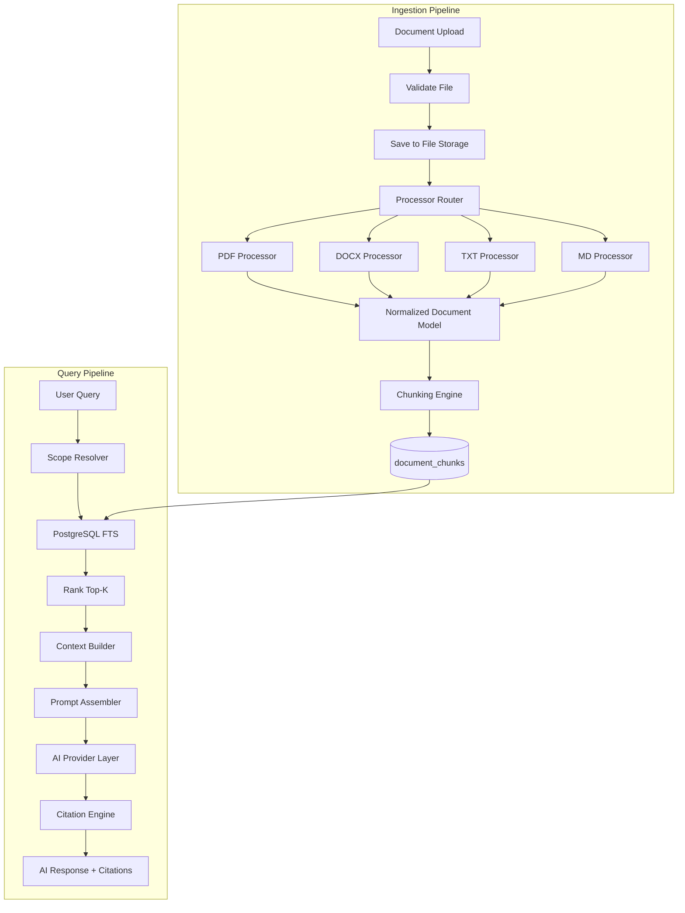

### 1.2 Two Pipelines

| Pipeline | Trigger | Async | Output |
|----------|---------|-------|--------|
| **Ingestion** | `POST /documents/upload` | Yes (BackgroundTasks) | `document_chunks` rows |
| **Query** | `POST /chats/{id}/messages` | No (sync, ~1–3s) | `chat_messages` + `citations` |

### 1.3 Module Map (Backend)

```
backend/app/
├── processors/
│   ├── base.py              # BaseProcessor, NormalizedBlock
│   ├── router.py            # ProcessorFactory
│   ├── pdf_processor.py
│   ├── docx_processor.py
│   ├── text_processor.py    # TXT + MD
│   └── markdown_converter.py
├── chunking/
│   ├── chunker.py           # ChunkingEngine
│   └── models.py            # ChunkDraft
├── ai/
│   ├── providers/
│   │   ├── base.py          # AIProvider ABC
│   │   ├── gemini.py
│   │   └── ollama_qwen.py
│   ├── prompts.py
│   ├── context_builder.py
│   ├── retrieval.py         # FTS queries
│   └── citation_engine.py
└── services/
    ├── document_service.py  # orchestrates ingestion
    └── chat_service.py      # orchestrates query pipeline
```

---

## 2. PDF Processing Architecture

### 2.1 Flow Diagram

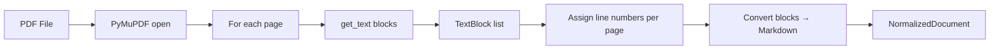

### 2.2 Processor Design

**Library:** `PyMuPDF` (`fitz`)

```python
@dataclass
class TextBlock:
    page_number: int          # 1-based
    line_start: int           # 1-based within page
    line_end: int
    text: str
    block_type: str           # "paragraph" | "heading" | "list"
    heading_level: int | None # 1-6 if heading

@dataclass
class NormalizedDocument:
    blocks: list[TextBlock]
    source_type: str            # "pdf"
```

### 2.3 Extraction Strategy

| Step | Method | Detail |
|------|--------|--------|
| Open document | `fitz.open(file_path)` | Handle encrypted PDF → fail gracefully |
| Per-page extract | `page.get_text("dict")` | Preserve block structure |
| Detect headings | Font size heuristic | Size > body × 1.2 → heading |
| Line numbering | Split block text by `\n` | `line_start` = first line index on page |
| Page boundary | Reset line counter per page | `page_number` = page index + 1 |

### 2.4 PDF Extraction Pseudocode

```python
class PDFProcessor(BaseProcessor):
    def extract(self, file_path: str) -> NormalizedDocument:
        doc = fitz.open(file_path)
        blocks: list[TextBlock] = []

        for page_idx in range(len(doc)):
            page = doc[page_idx]
            page_number = page_idx + 1
            page_dict = page.get_text("dict")
            line_counter = 1

            for block in page_dict["blocks"]:
                if block["type"] != 0:  # text block only
                    continue
                text, block_type, level = self._parse_block(block)
                lines = text.split("\n")
                line_end = line_counter + len(lines) - 1

                blocks.append(TextBlock(
                    page_number=page_number,
                    line_start=line_counter,
                    line_end=line_end,
                    text=text.strip(),
                    block_type=block_type,
                    heading_level=level,
                ))
                line_counter = line_end + 1

        return NormalizedDocument(blocks=blocks, source_type="pdf")
```

### 2.5 PDF Edge Cases

| Case | Handling |
|------|----------|
| Scanned PDF (no text) | `status = failed`, message "PDF không có text layer" |
| Multi-column layout | PyMuPDF reading order — acceptable for MVP |
| Images/diagrams | Skip; caption text if extractable |
| Very large PDF (>50MB) | Reject at upload validation |
| Password-protected | Return error, `status = failed` |

### 2.6 PDF → Markdown Mapping

| Block type | Markdown |
|------------|----------|
| heading level 1 | `# {text}` |
| heading level 2 | `## {text}` |
| heading level 3 | `### {text}` |
| paragraph | `{text}\n\n` |
| list item | `- {text}` |

---

## 3. DOCX Processing Architecture

### 3.1 Flow Diagram

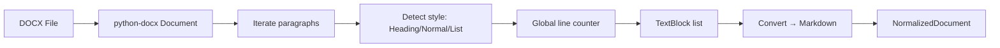

### 3.2 Processor Design

**Library:** `python-docx`

```python
class DOCXProcessor(BaseProcessor):
    HEADING_STYLES = {
        "Heading 1": 1, "Heading 2": 2, "Heading 3": 3,
        "Heading 4": 4, "Heading 5": 5, "Heading 6": 6,
    }

    def extract(self, file_path: str) -> NormalizedDocument:
        doc = Document(file_path)
        blocks: list[TextBlock] = []
        line_counter = 1

        for para in doc.paragraphs:
            text = para.text.strip()
            if not text:
                continue

            style_name = para.style.name if para.style else "Normal"
            heading_level = self.HEADING_STYLES.get(style_name)
            block_type = "heading" if heading_level else "paragraph"
            lines = text.split("\n")
            line_end = line_counter + len(lines) - 1

            blocks.append(TextBlock(
                page_number=None,       # DOCX has no pages in MVP
                line_start=line_counter,
                line_end=line_end,
                text=text,
                block_type=block_type,
                heading_level=heading_level,
            ))
            line_counter = line_end + 1

        return NormalizedDocument(blocks=blocks, source_type="docx")
```

### 3.3 DOCX Metadata Rules

| Field | DOCX value | Citation display |
|-------|------------|------------------|
| `page_number` | `NULL` | UI: "Dòng 120–145" (không hiện trang) |
| `line_start` | Global paragraph line | **Bắt buộc** |
| `line_end` | Global paragraph line | **Bắt buộc** |
| `heading` | Paragraph text if heading | Optional, boosts FTS |

### 3.4 DOCX Edge Cases

| Case | Handling |
|------|----------|
| Tables | Extract cell text row by row (MVP: plain text) |
| Images | Skip |
| `.doc` (legacy) | Reject MVP — chỉ DOCX |
| Empty document | `status = failed` |

---

## 4. TXT & Markdown Processing

### 4.1 Text Processor (TXT + MD)


```python
class TextProcessor(BaseProcessor):
    def extract(self, file_path: str, is_markdown: bool) -> NormalizedDocument:
        content = Path(file_path).read_text(encoding="utf-8")
        blocks: list[TextBlock] = []
        line_counter = 1

        for paragraph in content.split("\n\n"):
            paragraph = paragraph.strip()
            if not paragraph:
                continue

            heading_level = None
            block_type = "paragraph"
            if is_markdown and paragraph.startswith("#"):
                heading_level = len(paragraph) - len(paragraph.lstrip("#"))
                block_type = "heading"

            lines = paragraph.split("\n")
            line_end = line_counter + len(lines) - 1

            blocks.append(TextBlock(
                page_number=None,
                line_start=line_counter,
                line_end=line_end,
                text=paragraph,
                block_type=block_type,
                heading_level=heading_level,
            ))
            line_counter = line_end + 2  # account for blank line separator

        return NormalizedDocument(blocks=blocks, source_type="md" if is_markdown else "txt")
```

---

## 5. Markdown Conversion Strategy

### 5.1 Unified Intermediate Format

Tất cả processors output **`NormalizedDocument`** → **`MarkdownConverter`** → markdown string per block.

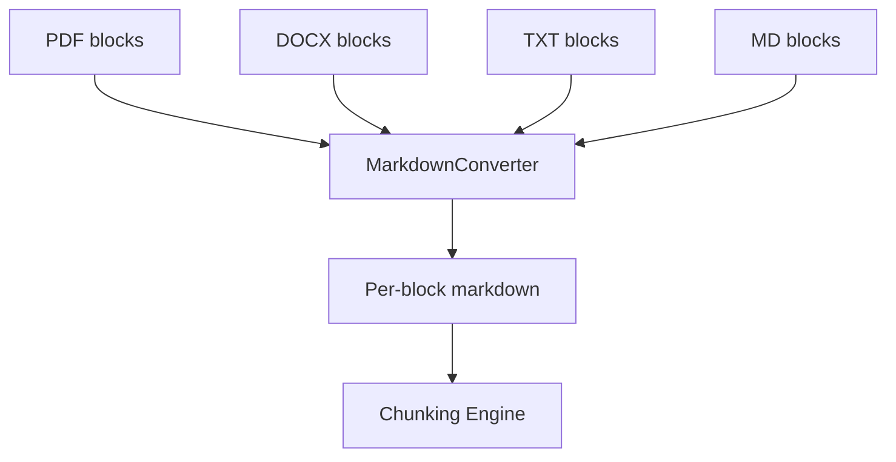

### 5.2 Conversion Rules

```python
class MarkdownConverter:
  def block_to_markdown(self, block: TextBlock) -> str:
        if block.block_type == "heading" and block.heading_level:
            prefix = "#" * block.heading_level
            return f"{prefix} {block.text}"
        if block.block_type == "list":
            return "\n".join(f"- {line}" for line in block.text.split("\n"))
        return block.text
```

### 5.3 Dual Storage in `document_chunks`

| Column | Content | Purpose |
|--------|---------|---------|
| `content` | Plain text (strip markdown syntax) | FTS indexing |
| `content_markdown` | Full markdown | Gemini context + viewer |

```python
def to_plain_text(md: str) -> str:
    # MVP: simple strip — no full markdown parser needed
    return re.sub(r"[#*_`\[\]]", "", md).strip()
```

### 5.4 Why Markdown-First

| Benefit | Explanation |
|---------|-------------|
| Consistent chunk format | All file types → same structure |
| Readable context for AI | Gemini understands `# Heading` hierarchy |
| Future-proof | Same format for Notes, Website post-MVP |
| Viewer reuse | `content_markdown` renders in Document Viewer |

---

## 6. Chunking Strategy

### 6.1 Chunking Flow

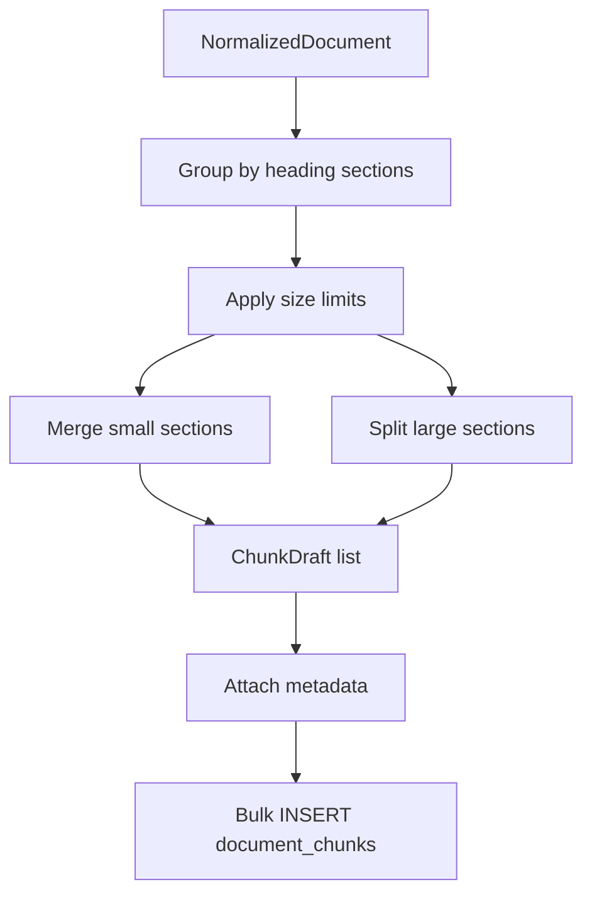

### 6.2 Parameters

| Parameter | Value | Rationale |
|-----------|-------|-----------|
| Target size | **800–1,200 tokens** (~3,200–4,800 chars) | Fits Gemini context budget |
| Min chunk size | 200 chars | Avoid tiny fragments |
| Max chunk size | 6,000 chars | Hard limit |
| Overlap | **0** (MVP) | Simpler citation boundaries |
| Split priority | 1. Heading boundary → 2. Paragraph → 3. Sentence | Preserve semantic units |

### 6.3 ChunkDraft Model

```python
@dataclass
class ChunkDraft:
    document_id: UUID
    chunk_index: int
    content: str              # plain text for FTS
    content_markdown: str
    page_number: int | None
    line_start: int
    line_end: int
    heading: str | None       # section heading if any
```

### 6.4 Chunking Algorithm

```python
class ChunkingEngine:
    TARGET_CHARS = 4000
    MAX_CHARS = 6000

    def chunk(self, document_id: UUID, blocks: list[TextBlock]) -> list[ChunkDraft]:
        sections = self._group_by_heading(blocks)
        raw_chunks = []

        for section in sections:
            text = "\n\n".join(MarkdownConverter().block_to_markdown(b) for b in section)
            if len(text) <= self.MAX_CHARS:
                raw_chunks.append((section, text))
            else:
                raw_chunks.extend(self._split_large_section(section, text))

        return self._build_drafts(document_id, raw_chunks)

    def _build_drafts(self, document_id, raw_chunks) -> list[ChunkDraft]:
        drafts = []
        for idx, (blocks, md_text) in enumerate(raw_chunks):
            drafts.append(ChunkDraft(
                document_id=document_id,
                chunk_index=idx,
                content=to_plain_text(md_text),
                content_markdown=md_text,
                page_number=blocks[0].page_number,
                line_start=blocks[0].line_start,
                line_end=blocks[-1].line_end,
                heading=blocks[0].text if blocks[0].block_type == "heading" else None,
            ))
        return drafts
```

### 6.5 Metadata Strategy

Mỗi chunk **bắt buộc** có metadata sau khi persist:

| Field | Source | Nullable | Citation use |
|-------|--------|----------|--------------|
| `document_id` | Upload context | No | FK |
| `chunk_index` | Sequential 0..N | No | Ordering |
| `page_number` | First block in chunk | Yes (TXT/MD/DOCX) | **Display "Trang X"** |
| `line_start` | First block `line_start` | No | **Display "Dòng X"** |
| `line_end` | Last block `line_end` | No | **Display "Dòng Y"** |
| `content` | Plain text | No | FTS |
| `content_markdown` | Markdown | No | AI context |
| `heading` | Section title | Yes | FTS weight A |
| `search_vector` | DB trigger | Auto | Retrieval |

### 6.6 Database Insert

```python
async def persist_chunks(db: Session, drafts: list[ChunkDraft]) -> int:
    db.execute(
        insert(DocumentChunk),
        [d.__dict__ for d in drafts]
    )
    db.execute(text("ANALYZE document_chunks"))
    return len(drafts)
```

---

## 7. Retrieval Strategy — PostgreSQL FTS

### 7.1 Retrieval Architecture

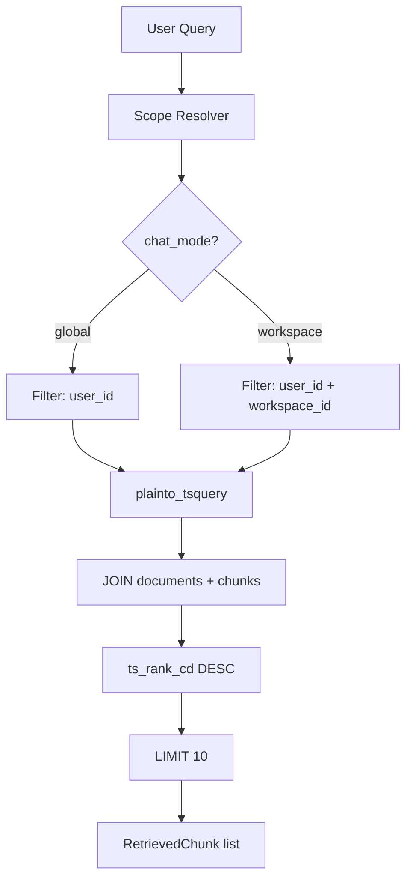

### 7.2 Scope Resolver

```python
@dataclass
class RetrievalScope:
    user_id: UUID
    workspace_id: UUID | None = None  # None = global

def resolve_scope(chat: Chat) -> RetrievalScope:
    if chat.chat_mode == "workspace":
        return RetrievalScope(user_id=chat.user_id, workspace_id=chat.workspace_id)
    return RetrievalScope(user_id=chat.user_id)
```

### 7.3 FTS Query (Production)

```python
RETRIEVAL_SQL = """
SELECT
    dc.id            AS chunk_id,
    dc.document_id,
    d.file_name      AS source_name,
    dc.page_number,
    dc.line_start,
    dc.line_end,
    dc.content_markdown,
    dc.heading,
    ts_rank_cd(dc.search_vector, q, 32) AS rank
FROM document_chunks dc
INNER JOIN documents d ON d.id = dc.document_id
CROSS JOIN plainto_tsquery('simple', :query) q
WHERE d.user_id = :user_id
  AND d.status = 'processed'
  AND dc.search_vector @@ q
  AND (:workspace_id IS NULL OR d.workspace_id = :workspace_id)
ORDER BY rank DESC
LIMIT :limit
"""
```

### 7.4 RetrievedChunk Model

```python
@dataclass
class RetrievedChunk:
    chunk_id: UUID
    document_id: UUID
    source_name: str
    page_number: int | None
    line_start: int
    line_end: int
    content_markdown: str
    heading: str | None
    rank: float
```

### 7.5 Retrieval Tuning

| Technique | Implementation |
|-----------|----------------|
| Weighted headings | `setweight` A on heading, B on content (DB trigger) |
| Rank normalization | `ts_rank_cd(..., 32)` |
| Top-K | `LIMIT 10` (~40K chars context max) |
| Empty results | Return assistant message: "Không tìm thấy thông tin trong tài liệu của bạn." |
| Filename boost (optional) | `pg_trgm` on `documents.file_name` if query matches filename pattern |

### 7.6 Context Budget

| Component | Token budget |
|-----------|--------------|
| System prompt | ~300 |
| Retrieved chunks (10 × ~400 tokens) | ~4,000 |
| Chat history (last 5 turns) | ~1,500 |
| User query | ~200 |
| **Total input** | **~6,000** (within Gemini Flash limit) |

---

## 8. Citation Generation Strategy

### 8.1 Citation Pipeline

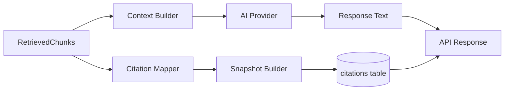

### 8.2 Core Principle: Citation from Retrieval, Not from AI

**Không parse citation từ free-text AI response.** Citations = **chunks đã dùng làm context**.

| Approach | MVP choice | Why |
|----------|------------|-----|
| AI generates `[1][2]` references | ✗ | Hallucination risk |
| Map retrieved chunks → citations | **✓** | Deterministic, accurate |
| AI cites inline with file names | ✗ | Unreliable |

### 8.3 Citation Mapper

```python
class CitationEngine:
    def build_citations(
        self,
        message_id: UUID,
        used_chunks: list[RetrievedChunk],
    ) -> list[Citation]:
        citations = []
        for chunk in used_chunks:
            citations.append(Citation(
                message_id=message_id,
                document_id=chunk.document_id,
                chunk_id=chunk.chunk_id,
                source_name=chunk.source_name,
                source_type="document",
                page_number=chunk.page_number,
                line_start=chunk.line_start,
                line_end=chunk.line_end,
                excerpt=chunk.content_markdown[:300],
            ))
        return citations
```

### 8.4 API Response Format

```json
{
  "message": {
    "role": "assistant",
    "content": "useState và useEffect khác nhau ở chỗ..."
  },
  "citations": [
    {
      "source_name": "React_Hooks_Guide.pdf",
      "source_type": "document",
      "page_number": 5,
      "line_start": 120,
      "line_end": 145,
      "excerpt": "useEffect is a React Hook..."
    }
  ]
}
```

### 8.5 UI Display Rules

| Field present | Display format |
|---------------|----------------|
| page + line | `React_Hooks_Guide.pdf` — Trang 5, Dòng 120–145 |
| line only | `Django_Tutorial.md` — Dòng 45–62 |
| page only | `Manual.pdf` — Trang 12 |

### 8.6 Citation Integrity Checklist

- [ ] Every assistant message with FTS hits has ≥1 citation
- [ ] `source_name` = `documents.file_name` at write time
- [ ] `page_number`, `line_start`, `line_end` copied from `document_chunks`
- [ ] `excerpt` ≤ 300 chars from `content_markdown`
- [ ] No citation when FTS returns 0 results

---

## 9. AI Provider Layer

### 9.1 Architecture

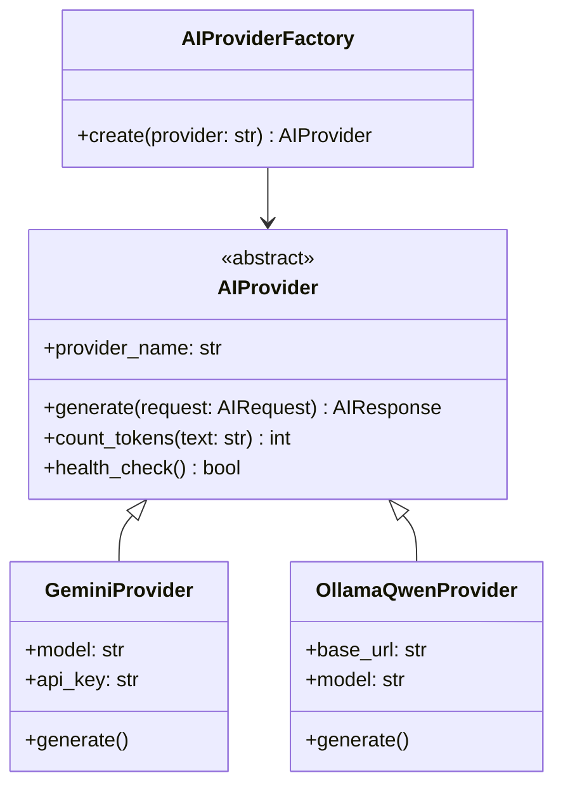

### 9.2 Abstract Interface

```python
# backend/app/ai/providers/base.py

@dataclass
class AIRequest:
    system_prompt: str
    user_prompt: str
    context: str
    temperature: float = 0.3
    max_tokens: int = 2048

@dataclass
class AIResponse:
    content: str
    token_count: int
    provider: str
    model: str
    latency_ms: int

class AIProvider(ABC):
    @property
    @abstractmethod
    def provider_name(self) -> str: ...

    @abstractmethod
    async def generate(self, request: AIRequest) -> AIResponse: ...

    @abstractmethod
    async def health_check(self) -> bool: ...
```

### 9.3 Gemini Provider

```python
class GeminiProvider(AIProvider):
    provider_name = "gemini"

    def __init__(self, api_key: str, model: str = "gemini-1.5-flash"):
        self.client = genai.GenerativeModel(model)
        self.model = model

    async def generate(self, request: AIRequest) -> AIResponse:
        prompt = f"{request.system_prompt}\n\n## Context\n{request.context}\n\n## Question\n{request.user_prompt}"
        start = time.monotonic()
        response = await self.client.generate_content_async(
            prompt,
            generation_config={"temperature": request.temperature, "max_output_tokens": request.max_tokens},
        )
        return AIResponse(
            content=response.text,
            token_count=response.usage_metadata.total_token_count,
            provider="gemini",
            model=self.model,
            latency_ms=int((time.monotonic() - start) * 1000),
        )
```

**Config (.env):**
```
AI_PROVIDER=gemini
GEMINI_API_KEY=...
GEMINI_MODEL=gemini-1.5-flash
```

### 9.4 Qwen Local (Ollama) Provider

```python
class OllamaQwenProvider(AIProvider):
    provider_name = "ollama_qwen"

    def __init__(self, base_url: str = "http://localhost:11434", model: str = "qwen2.5:7b"):
        self.base_url = base_url
        self.model = model

    async def generate(self, request: AIRequest) -> AIResponse:
        payload = {
            "model": self.model,
            "prompt": f"{request.system_prompt}\n\n## Context\n{request.context}\n\n## Question\n{request.user_prompt}",
            "stream": False,
            "options": {"temperature": request.temperature, "num_predict": request.max_tokens},
        }
        start = time.monotonic()
        async with httpx.AsyncClient() as client:
            resp = await client.post(f"{self.base_url}/api/generate", json=payload, timeout=120)
        data = resp.json()
        return AIResponse(
            content=data["response"],
            token_count=data.get("eval_count", 0),
            provider="ollama_qwen",
            model=self.model,
            latency_ms=int((time.monotonic() - start) * 1000),
        )

    async def health_check(self) -> bool:
        async with httpx.AsyncClient() as client:
            resp = await client.get(f"{self.base_url}/api/tags")
            return resp.status_code == 200
```

**Config (.env):**
```
AI_PROVIDER=ollama_qwen
OLLAMA_BASE_URL=http://localhost:11434
OLLAMA_MODEL=qwen2.5:7b
```

### 9.5 Provider Factory

```python
class AIProviderFactory:
    @staticmethod
    def create(settings: Settings) -> AIProvider:
        match settings.ai_provider:
            case "gemini":
                return GeminiProvider(api_key=settings.gemini_api_key, model=settings.gemini_model)
            case "ollama_qwen":
                return OllamaQwenProvider(base_url=settings.ollama_base_url, model=settings.ollama_model)
            case _:
                raise ValueError(f"Unknown AI provider: {settings.ai_provider}")
```

### 9.6 Provider Comparison

| Aspect | Gemini API | Qwen (Ollama) |
|--------|------------|---------------|
| Cost | API billing | Free (local GPU/RAM) |
| Latency | 1–3s | 3–15s (depends on hardware) |
| Quality | High | Good for MVP demo |
| Offline | No | **Yes** |
| Setup | API key only | Ollama + `qwen2.5:7b` pull |
| MVP default | **Primary** | Dev / fallback |

### 9.7 System Prompt Template

```python
CHAT_SYSTEM_PROMPT = """You are DevHub AI, a technical learning assistant.

RULES:
1. Answer ONLY based on the provided context from the user's documents.
2. If the context does not contain the answer, say: "Tôi không tìm thấy thông tin này trong tài liệu của bạn."
3. Do NOT invent facts or sources.
4. Answer in the same language as the user's question.
5. Be concise and technical.

The user's documents are provided below as context. Each section is from a specific source."""
```

---

## 10. Complete Query Pipeline

### 10.1 End-to-End Sequence

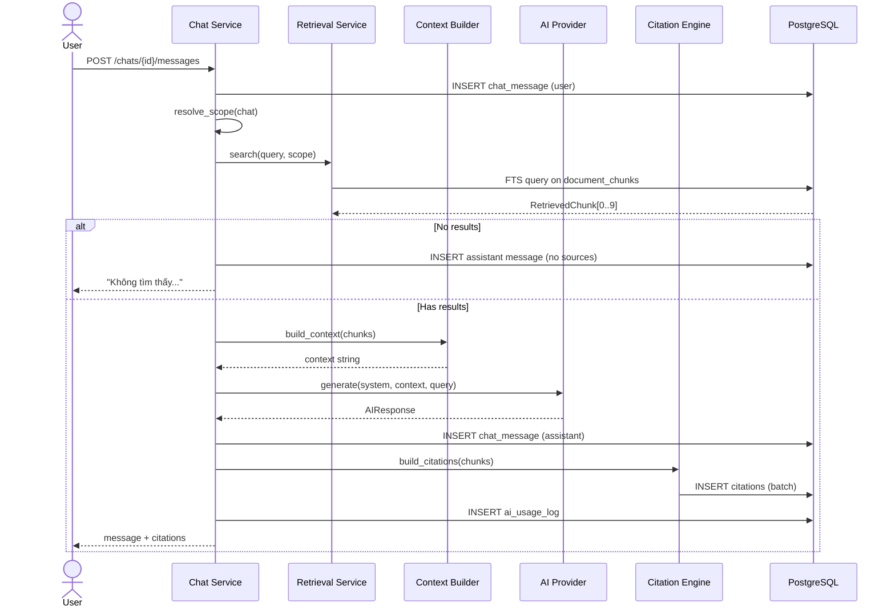

### 10.2 Context Builder

```python
class ContextBuilder:
    def build(self, chunks: list[RetrievedChunk]) -> str:
        parts = []
        for i, chunk in enumerate(chunks, 1):
            loc = self._format_location(chunk)
            parts.append(f"--- Source {i}: {chunk.source_name} ({loc}) ---\n{chunk.content_markdown}")
        return "\n\n".join(parts)

    def _format_location(self, chunk: RetrievedChunk) -> str:
        if chunk.page_number:
            return f"Trang {chunk.page_number}, Dòng {chunk.line_start}-{chunk.line_end}"
        return f"Dòng {chunk.line_start}-{chunk.line_end}"
```

### 10.3 Chat Service Orchestration

```python
class ChatService:
    async def send_message(self, chat_id: UUID, content: str, user: User) -> ChatMessageResponse:
        chat = await self.get_chat(chat_id, user.id)
        await self.save_user_message(chat_id, content)

        scope = resolve_scope(chat)
        chunks = await self.retrieval.search(content, scope, limit=10)

        if not chunks:
            msg = await self.save_assistant_message(chat_id, NO_RESULTS_MESSAGE)
            return ChatMessageResponse(message=msg, citations=[])

        context = self.context_builder.build(chunks)
        ai_resp = await self.ai_provider.generate(AIRequest(
            system_prompt=CHAT_SYSTEM_PROMPT,
            user_prompt=content,
            context=context,
        ))

        msg = await self.save_assistant_message(chat_id, ai_resp.content, ai_resp.token_count)
        citations = self.citation_engine.build_citations(msg.id, chunks)
        await self.citation_repo.bulk_insert(citations)
        await self.ai_usage_log(user.id, "chat", ai_resp.token_count)

        return ChatMessageResponse(message=msg, citations=citations)
```

---

## 11. Ingestion Pipeline — End-to-End

### 11.1 Sequence Diagram

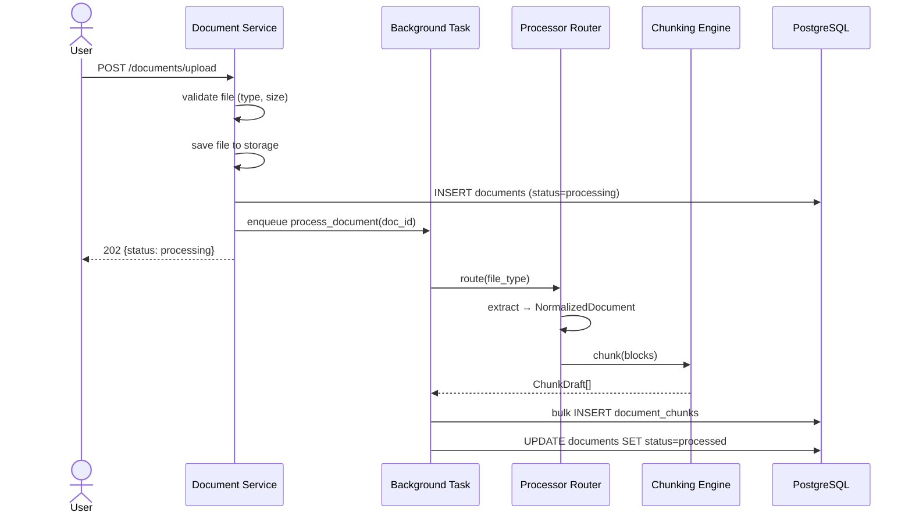

### 11.2 Processor Router

```python
class ProcessorFactory:
    PROCESSORS = {
        "pdf": PDFProcessor(),
        "docx": DOCXProcessor(),
        "txt": TextProcessor(is_markdown=False),
        "md": TextProcessor(is_markdown=True),
    }

    @classmethod
    def get(cls, file_type: str) -> BaseProcessor:
        processor = cls.PROCESSORS.get(file_type)
        if not processor:
            raise UnsupportedFileTypeError(file_type)
        return processor
```

### 11.3 Document Status State Machine

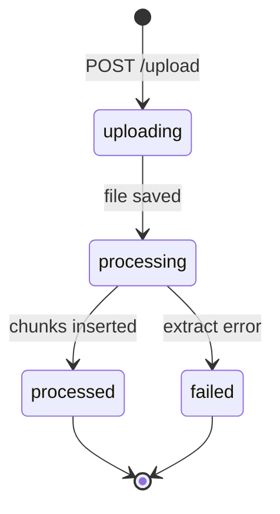

---

## 12. Architecture Diagrams

### 12.1 Component Diagram

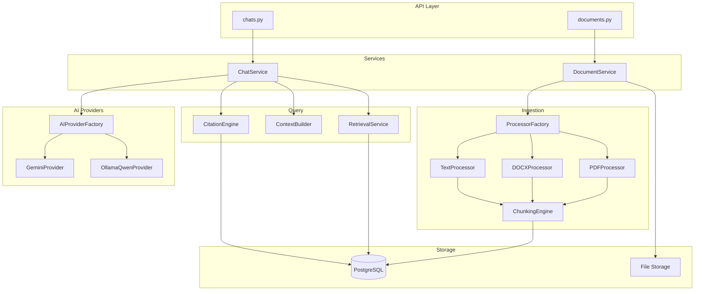

### 12.2 Data Flow Diagram

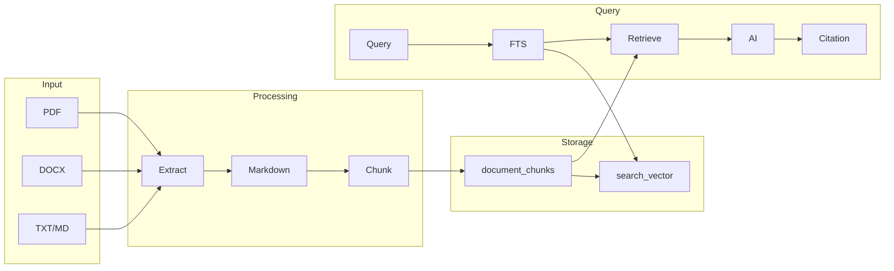

### 12.3 Deployment Diagram (MVP)

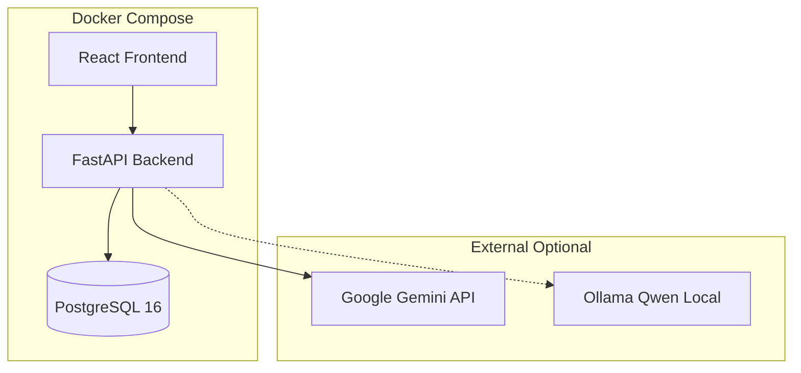

---

## 13. Error Handling & Observability

### 13.1 Error Matrix

| Stage | Error | User message | Document status |
|-------|-------|--------------|-----------------|
| Upload | Invalid file type | "Loại file không hỗ trợ" | — |
| Upload | File > 50MB | "File quá lớn" | — |
| Extract | Encrypted PDF | "Không đọc được PDF" | `failed` |
| Extract | Empty content | "Tài liệu trống" | `failed` |
| FTS | No matches | "Không tìm thấy thông tin..." | — |
| AI | Provider timeout | "AI tạm thời không khả dụng" | — |
| AI | Rate limit | "Vui lòng thử lại sau" | — |

### 13.2 Logging

```python
logger.info("document_processed", extra={
    "document_id": str(doc_id),
    "file_type": file_type,
    "chunk_count": count,
    "duration_ms": duration,
})

logger.info("chat_completed", extra={
    "chat_id": str(chat_id),
    "provider": ai_resp.provider,
    "chunks_used": len(chunks),
    "citations": len(citations),
    "latency_ms": ai_resp.latency_ms,
})
```

### 13.3 `ai_usage_logs` Tracking

| Field | Value |
|-------|-------|
| `action_type` | `chat` |
| `token_count` | From `AIResponse.token_count` |
| `user_id` | Current user |

---

## 14. Implementation Roadmap

### 14.1 Timeline (aligned with MVP-8W 8 weeks)

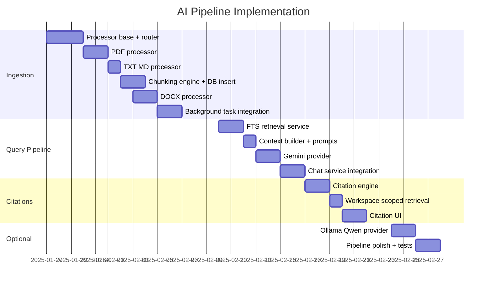

### 14.2 Sprint Breakdown

| Sprint | Week | Deliverables | Exit criteria |
|--------|------|--------------|---------------|
| S1 | 4 | PDF + TXT/MD ingestion | Upload MD → chunks in DB |
| S2 | 5 | DOCX + status polling | Upload PDF/DOCX → `processed` |
| S3 | 6 | FTS + Gemini + Global Chat | Ask question → AI answer |
| S4 | 7 | Citations + Workspace Chat | Answer shows file, page, line |
| S5 | 8 | Ollama fallback + tests | Switch `AI_PROVIDER` env |

### 14.3 Implementation Checklist

#### Ingestion (Week 4–5)

- [ ] `BaseProcessor` + `NormalizedDocument` + `TextBlock`
- [ ] `ProcessorFactory` router
- [ ] `PDFProcessor` with page/line metadata
- [ ] `DOCXProcessor` with global line numbers
- [ ] `TextProcessor` for TXT/MD
- [ ] `MarkdownConverter`
- [ ] `ChunkingEngine` with heading-aware split
- [ ] `persist_chunks()` bulk insert
- [ ] Background task in `document_service.py`
- [ ] Document status polling endpoint or WebSocket

#### Retrieval + AI (Week 6)

- [ ] `RetrievalService` with scoped FTS SQL
- [ ] `RetrievedChunk` model
- [ ] `ContextBuilder`
- [ ] `CHAT_SYSTEM_PROMPT`
- [ ] `AIProvider` ABC + `GeminiProvider`
- [ ] `AIProviderFactory`
- [ ] `ChatService.send_message()` orchestration

#### Citations (Week 7)

- [ ] `CitationEngine.build_citations()`
- [ ] Bulk insert citations
- [ ] API response schema with citations
- [ ] Frontend `CitationList` component
- [ ] Workspace-scoped FTS filter

#### Optional (Week 8)

- [ ] `OllamaQwenProvider`
- [ ] Provider health check endpoint
- [ ] Unit tests: chunking, citation mapping
- [ ] Integration test: upload → chat → citation

### 14.4 Test Scenarios

| # | Scenario | Expected |
|---|----------|----------|
| T1 | Upload `test.md` with `# Heading` | Chunks have `heading` set |
| T2 | Upload 5-page PDF | Chunks have `page_number` 1–5 |
| T3 | Global chat "React hooks" | Citations from any workspace |
| T4 | Workspace chat scoped | Citations only from that workspace |
| T5 | Query with no matches | No citations, fallback message |
| T6 | Switch to Ollama | Same citation format |
| T7 | Delete document | Old citations still show `source_name` |

---

## 15. Configuration Reference

```env
# AI Provider
AI_PROVIDER=gemini                    # gemini | ollama_qwen

# Gemini
GEMINI_API_KEY=your-key
GEMINI_MODEL=gemini-1.5-flash

# Ollama / Qwen
OLLAMA_BASE_URL=http://localhost:11434
OLLAMA_MODEL=qwen2.5:7b

# Chunking
CHUNK_TARGET_CHARS=4000
CHUNK_MAX_CHARS=6000
RETRIEVAL_TOP_K=10

# FTS
FTS_CONFIG=simple                     # simple | english
```

---

## 16. Summary

| Requirement | Section | Status |
|-------------|---------|--------|
| PDF processing | §2 | Designed |
| DOCX processing | §3 | Designed |
| Markdown conversion | §5 | Designed |
| Chunking strategy | §6 | Designed |
| Metadata (page, line, content) | §6.5 | Designed |
| PostgreSQL FTS retrieval | §7 | Designed |
| Citation generation | §8 | Designed |
| AI Provider Layer (Gemini + Qwen) | §9 | Designed |
| Architecture diagrams | §1, §10–§12 | Done |
| Implementation roadmap | §14 | Done |

**Pipeline principle:** Citations come from **retrieved chunks**, not from AI hallucination. FTS finds chunks → AI reads chunks → citations snapshot chunk metadata.

---

## Appendix — Related Documents

| Document | Purpose |
|----------|---------|
| [18-Final-Database.md](./18-Final-Database.md) | Schema, FTS indexes, chunk table |
| [14-MVP-Version.md](./14-MVP-Version.md) | MVP scope & timeline |
| [07-API-Design.md](./07-API-Design.md) | Chat API contract |
| [09-Backend-Structure.md](./09-Backend-Structure.md) | Module folders |
