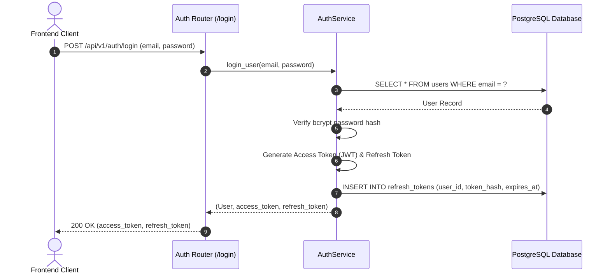
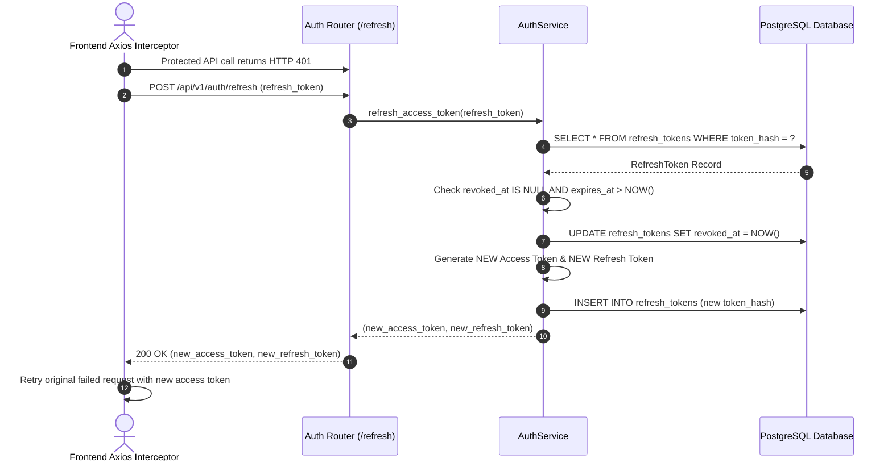

# DevHub AI - Authentication Sequence Diagrams

## 1. Login & Token Issue Flow

```mermaid
sequenceDiagram
    autonumber
    actor Client as Frontend Client
    participant AuthAPI as Auth Router (/login)
    participant AuthService as AuthService
    participant DB as PostgreSQL Database

    Client->>AuthAPI: POST /api/v1/auth/login (email, password)
    AuthAPI->>AuthService: login_user(email, password)
    AuthService->>DB: SELECT * FROM users WHERE email = ?
    DB-->>AuthService: User Record
    AuthService->>AuthService: Verify bcrypt password hash
    AuthService->>AuthService: Generate Access Token (JWT) & Refresh Token
    AuthService->>DB: INSERT INTO refresh_tokens (user_id, token_hash, expires_at)
    AuthService-->>AuthAPI: (User, access_token, refresh_token)
    AuthAPI-->>Client: 200 OK (access_token, refresh_token)
```

---

## 2. Refresh Token Rotation & Interceptor Flow

```mermaid
sequenceDiagram
    autonumber
    actor Client as Frontend Axios Interceptor
    participant AuthAPI as Auth Router (/refresh)
    participant AuthService as AuthService
    participant DB as PostgreSQL Database

    Client->>AuthAPI: Protected API call returns HTTP 401
    Client->>AuthAPI: POST /api/v1/auth/refresh (refresh_token)
    AuthAPI->>AuthService: refresh_access_token(refresh_token)
    AuthService->>DB: SELECT * FROM refresh_tokens WHERE token_hash = ?
    DB-->>AuthService: RefreshToken Record
    AuthService->>AuthService: Check revoked_at IS NULL AND expires_at > NOW()
    AuthService->>DB: UPDATE refresh_tokens SET revoked_at = NOW()
    AuthService->>AuthService: Generate NEW Access Token & NEW Refresh Token
    AuthService->>DB: INSERT INTO refresh_tokens (new token_hash)
    AuthService-->>AuthAPI: (new_access_token, new_refresh_token)
    AuthAPI-->>Client: 200 OK (new_access_token, new_refresh_token)
    Client->>Client: Retry original failed request with new access token
```
