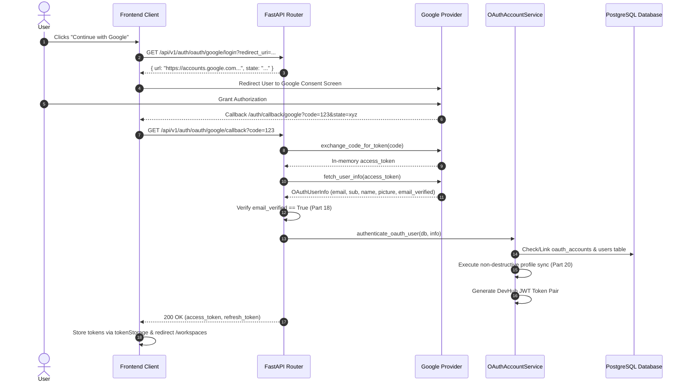

# DevHub AI - Google OAuth Sequence Diagrams

## Complete Handshake Sequence

```mermaid
sequenceDiagram
    autonumber
    actor User as User
    participant App as Frontend Client
    participant API as FastAPI Router
    participant Google as Google Provider
    participant Service as OAuthAccountService
    participant DB as PostgreSQL Database

    User->>App: Clicks "Continue with Google"
    App->>API: GET /api/v1/auth/oauth/google/login?redirect_uri=...
    API-->>App: { url: "https://accounts.google.com...", state: "..." }
    App->>Google: Redirect User to Google Consent Screen
    User->>Google: Grant Authorization
    Google-->>App: Callback /auth/callback/google?code=123&state=xyz
    App->>API: GET /api/v1/auth/oauth/google/callback?code=123
    API->>Google: exchange_code_for_token(code)
    Google-->>API: In-memory access_token
    API->>Google: fetch_user_info(access_token)
    Google-->>API: OAuthUserInfo (email, sub, name, picture, email_verified)
    API->>API: Verify email_verified == True (Part 18)
    API->>Service: authenticate_oauth_user(db, info)
    Service->>DB: Check/Link oauth_accounts & users table
    Service->>Service: Execute non-destructive profile sync (Part 20)
    Service->>Service: Generate DevHub JWT Token Pair
    API-->>App: 200 OK (access_token, refresh_token)
    App->>App: Store tokens via tokenStorage & redirect /workspaces
```
