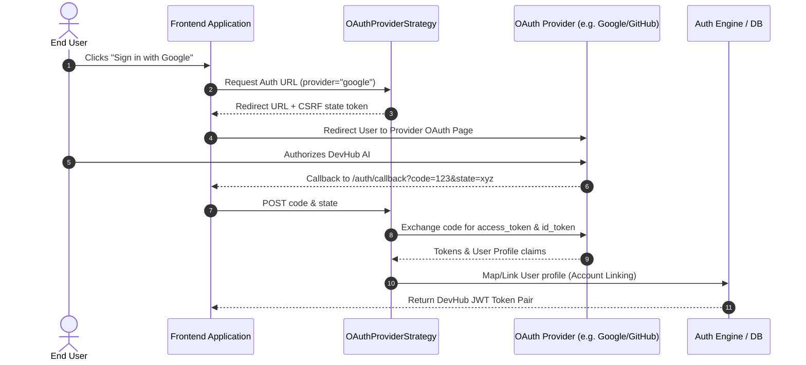

# DevHub AI - OAuth Provider Strategy Architecture

## Provider Strategy Design Pattern

To support future OAuth providers (Google, GitHub, Microsoft, Facebook, GitLab, LinkedIn) without modifying core authentication logic, the system utilizes the **Strategy Pattern**.

```
                           ┌──────────────────┐
                           │  IOAuthProvider  │ (Abstract Interface)
                           └────────┬─────────┘
                                    │
       ┌────────────────────┬───────┴────────────┬───────────────────┐
┌──────┴───────┐   ┌────────┴────────┐   ┌───────┴────────┐   ┌──────┴──────┐
│GoogleProvider│   │ GitHubProvider  │   │MSFTProvider    │   │... Provider │
└──────────────┘   └─────────────────┘   └────────────────┘   └─────────────┘
```

## Lifecycle & Sequence Diagram


