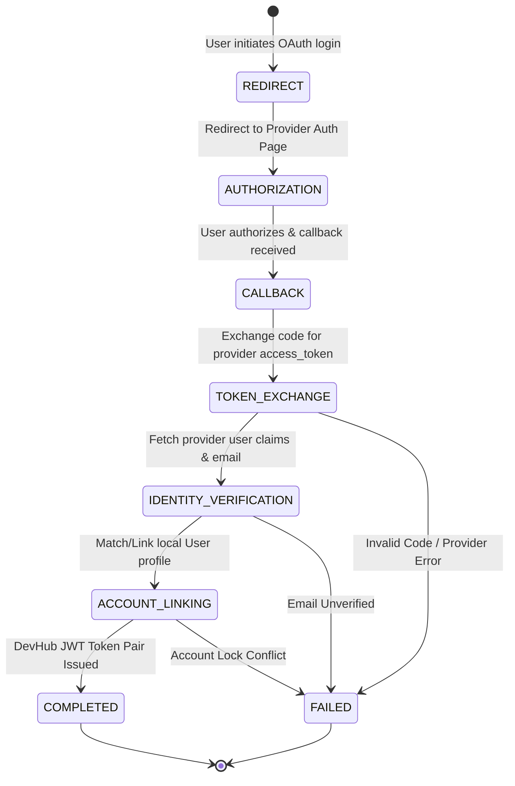

# DevHub AI - Formal OAuth State Machine Specification

## State Diagram

## State Rules
- **`REDIRECT`**: Generate PKCE / CSRF state token and compute authorization URL.
- **`AUTHORIZATION`**: External authorization prompt rendered by OAuth provider.
- **`CALLBACK`**: Validate CSRF state token and parse authorization code.
- **`TOKEN_EXCHANGE`**: Server-to-server token endpoint request.
- **`IDENTITY_VERIFICATION`**: Normalize provider identity schema (`OAuthUserInfo`).
- **`ACCOUNT_LINKING`**: Link to existing user via email or instantiate new user record.
- **`COMPLETED`**: Issue standard JWT token pair.
