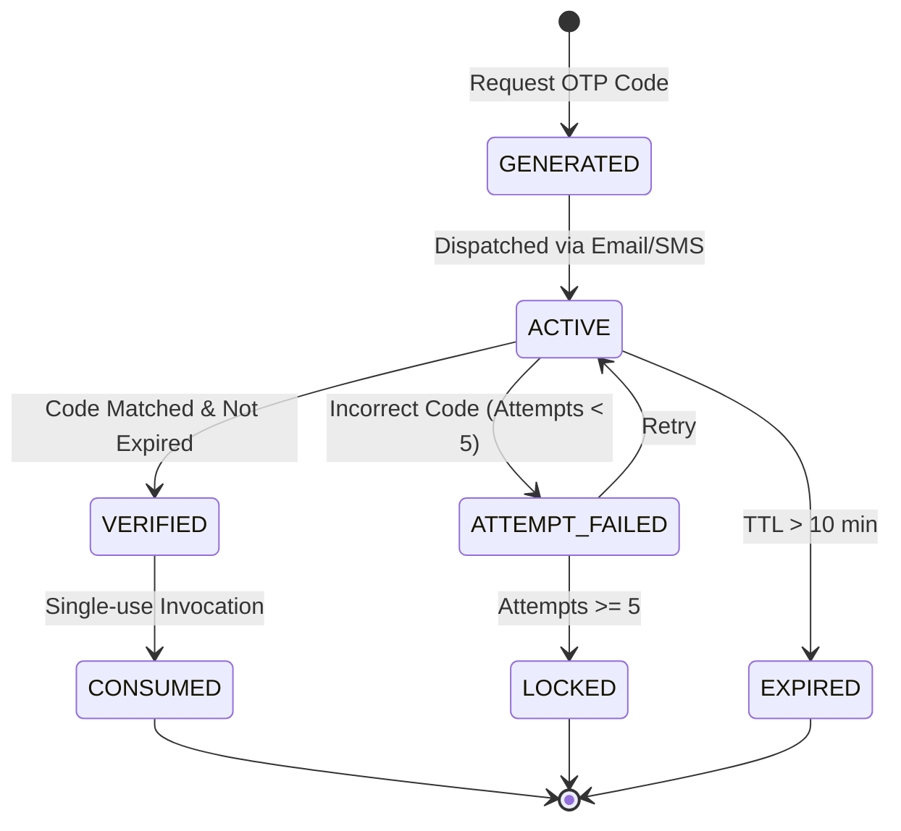

# DevHub AI - Unified OTP Module Architecture & State Machine

## Overview

The Unified OTP Module manages verification codes across multiple business scenarios (`REGISTER`, `PASSWORD_RESET`, `EMAIL_CHANGE`, `ACCOUNT_DELETE`, `TWO_FACTOR_AUTH`).

## Business Policies & Constraints
1. **Length**: 6-digit numeric code generated via `VerificationCodeGenerator.generate_numeric_otp()`.
2. **TTL / Expiration**: 10 minutes from generation.
3. **Max Attempts**: Maximum 5 failed verification attempts before invalidating the code.
4. **Cooldown Period**: 60 seconds minimum interval between consecutive resend requests for the same target.
5. **One-Time Usage**: Upon successful verification, code state transitions to `CONSUMED` and is immediately invalidated.

## OTP State Machine Diagram

