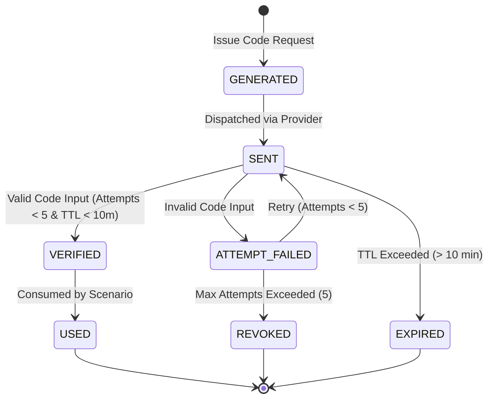

# DevHub AI - Formal OTP State Machine Specification

## State Diagram

## State Definitions & Recovery Rules
- **`GENERATED`**: Secure OTP code string created in memory/DB.
- **`SENT`**: Code successfully dispatched to email/SMS target.
- **`VERIFIED`**: OTP matched; state transitions to single-use consumption.
- **`USED`**: Terminal state preventing replay attacks.
- **`EXPIRED`**: Code automatically invalidated after 10-minute TTL.
- **`REVOKED`**: Locked out due to 5 consecutive failed attempts. User must wait 60s cooldown before requesting a new code.
