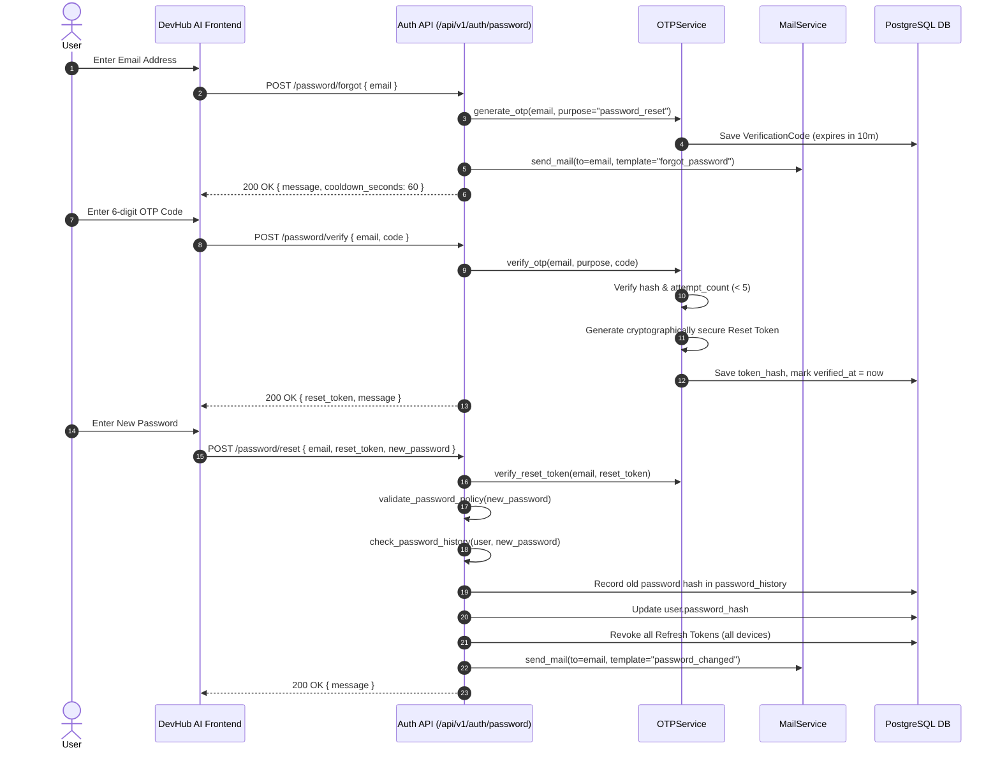

# DevHub AI - Password Reset & Verification Token Architecture (Phase 3)

## Overview
This document specifies the Password Reset flow and **Verification Token Architecture** implemented under Phase 3.

---

## Architectural Sequence

---

## Verification Token Controls (Part 16)
- Reset tokens are 32-byte cryptographically secure URL-safe tokens generated only upon successful 6-digit OTP verification.
- Only the SHA-256 hash of the reset token is stored in `verification_codes.token_hash`.
- Reset tokens are valid for 10 minutes, single-use only, and automatically revoked (`revoked_at = now`) after password reset completes.
