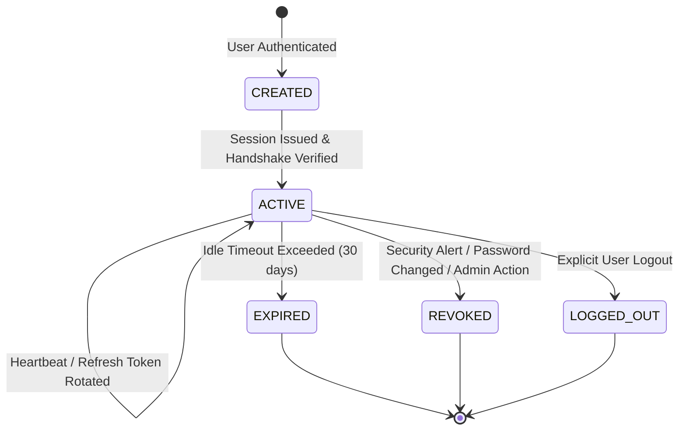

# DevHub AI - Formal Session State Machine Specification

## State Diagram

## State Rules & Transitions
- **`CREATED`**: Session record instantiated in `login_sessions` table.
- **`ACTIVE`**: Active session with non-expired token pair.
- **`EXPIRED`**: Inactivated automatically when `expires_at < NOW()`.
- **`REVOKED`**: Terminated remotely or via security policy invalidation.
- **`LOGGED_OUT`**: User explicitly triggered logout.
