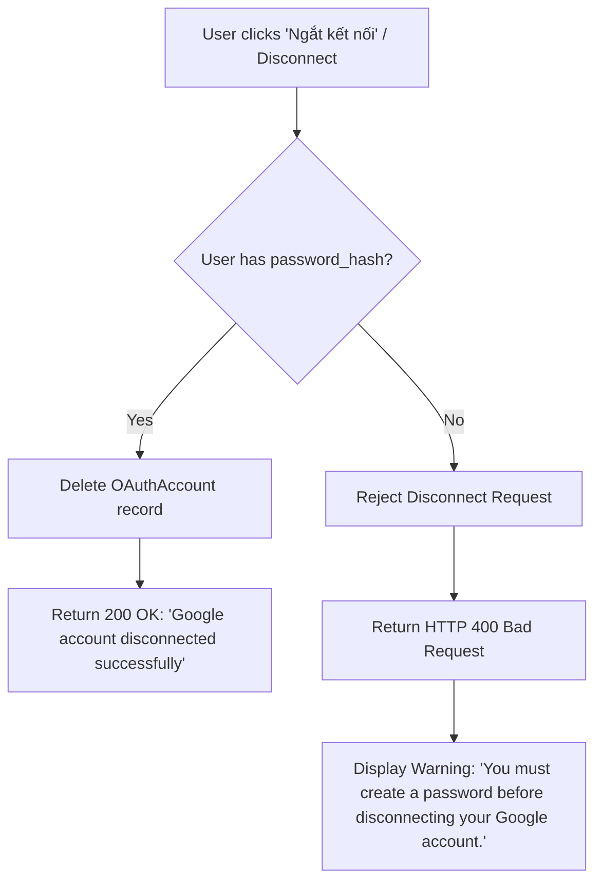

# DevHub AI - Safe Google Disconnect Policy Documentation (ADR 5)

## Overview
This document specifies the technical rules, verification flow, and UX requirements for the **Safe Google Disconnect Policy**, designed to guarantee that users can never disconnect Google authentication if doing so would leave their DevHub AI account inaccessible.

---

## Policy Definition

> [!IMPORTANT]
> **Anti-Lockout Rule:** A user MUST possess an active, valid local password (`users.password_hash IS NOT NULL AND LENGTH(users.password_hash) > 0`) prior to disconnecting their Google account.

If a user registered exclusively via Google OAuth (without setting an initial password), attempting to disconnect Google will be rejected by both the backend API and frontend Settings interface.

---

## Process & Decision Workflow



---

## API Specification

- **Endpoint:** `POST /api/v1/auth/oauth/google/disconnect`
- **Authentication:** Required (Bearer JWT Access Token)
- **Response (Success - 200 OK):**
  ```json
  {
    "message": "Google account disconnected successfully"
  }
  ```
- **Response (Failure - 400 Bad Request):**
  ```json
  {
    "detail": "You must create a password before disconnecting your Google account."
  }
  ```

---

## Frontend UX Guidelines

1. **Status Query:** The Settings page calls `GET /api/v1/auth/oauth/google/status` on load.
2. **Button State:** If `can_disconnect == false`, the "Ngắt kết nối" button is disabled.
3. **Warning Banner:** When `can_disconnect == false`, display an amber notice:
   > ⚠️ *Bạn cần tạo mật khẩu trước khi ngắt kết nối tài khoản Google.*
